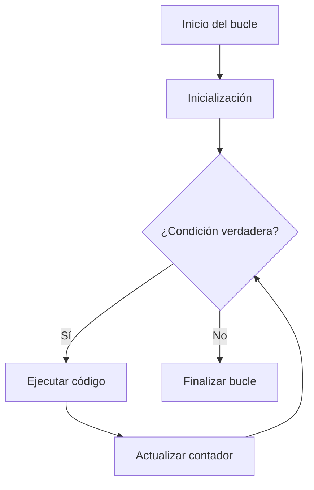
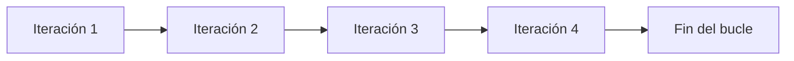
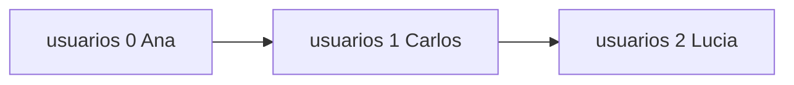
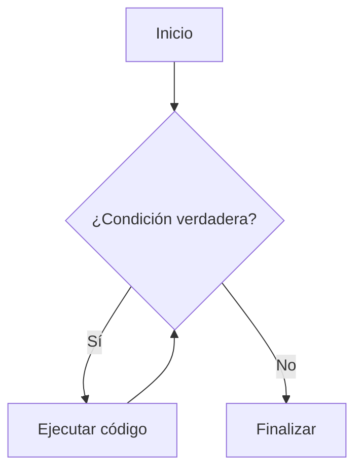
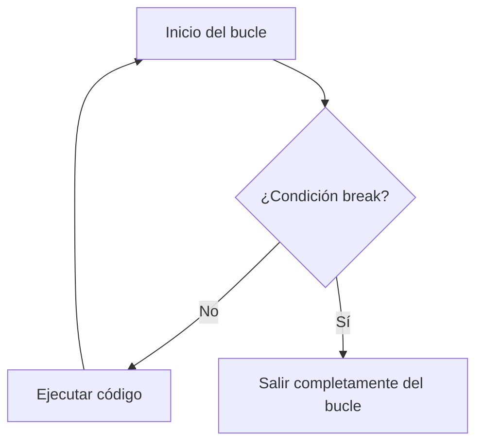
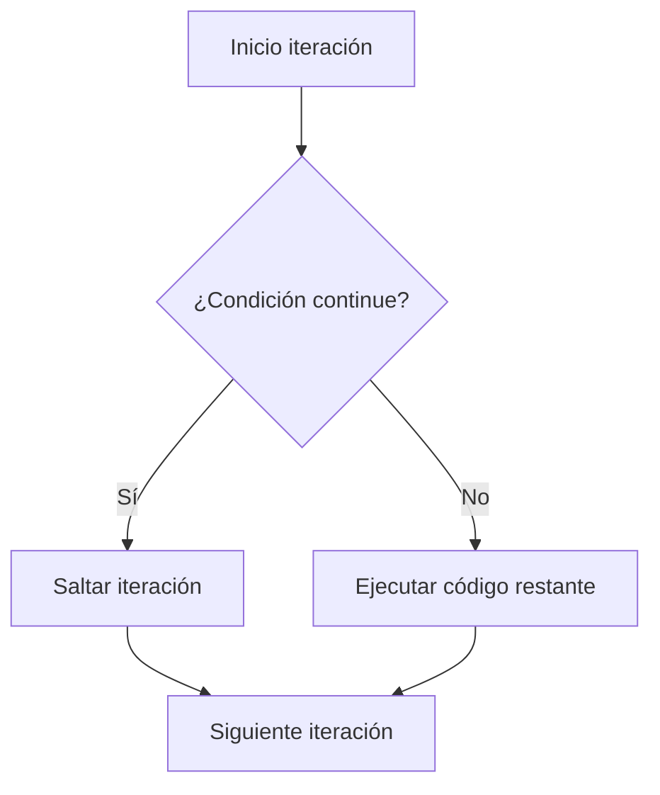

# 01. ¿Qué tipos de bucles hay en JS?

## Introducción
En programación, uno de los problemas más comunes consiste en **ejecutar una misma acción varias veces**. Existen muchísimas situaciones en las que una aplicación necesita **repetir instrucciones de manera automática**: mostrar datos en pantalla, recorrer listas de usuarios, procesar productos de una tienda online, validar formularios, leer información de una API o incluso generar elementos dinámicamente dentro de una página web. Para resolver este problema existen los bucles.

Los bucles (loops) son **estructuras de control que permiten repetir un bloque de código múltiples veces de forma automática y controlada**. Gracias a ellos, los desarrolladores pueden evitar escribir instrucciones repetitivas manualmente, consiguiendo un código **mucho más limpio, escalable y eficiente**.

JavaScript dispone de varios tipos de bucles, y cada uno de ellos está diseñado para situaciones específicas. Algunos ofrecen un **mayor control manual**, otros simplifican el recorrido de arrays y otros están pensados para trabajar con objetos o condiciones dinámicas.

Comprender cómo funcionan los bucles es fundamental, ya que son **una de las bases principales de cualquier lenguaje de programación moderno**.

## ¿Qué problema resuelven los bucles?
Para entender realmente la importancia de los bucles, primero debemos imaginar cómo sería programar sin ellos.

Supongamos que queremos mostrar por consola los números del 1 al 5. Sin utilizar ningún tipo de bucle, tendríamos que escribir manualmente cada instrucción:

```js
console.log(1);
console.log(2);
console.log(3);
console.log(4);
console.log(5);
```

Aunque en este caso el código parece sencillo, el problema aparece cuando la cantidad de repeticiones aumenta.

Imaginemos que ahora necesitamos:

- mostrar 1.000 números,
- recorrer todos los usuarios registrados de una aplicación,
- mostrar todos los mensajes de un chat,
- recorrer productos de un ecommerce,
- o procesar datos obtenidos desde una API.

Escribir manualmente cada instrucción sería **prácticamente imposible**. Aquí es donde entran en juego los bucles.

Los bucles permiten **automatizar tareas repetitivas** mediante estructuras que ejecutan código múltiples veces mientras se cumpla una condición determinada. Gracias a ellos, un programa puede **adaptarse dinámicamente a cantidades variables de información** sin necesidad de duplicar código constantemente.

Por ejemplo, el mismo caso anterior puede resolverse de forma mucho más eficiente utilizando un bucle for:

```js
for(let i = 1; i <= 5; i++) {
    console.log(i);
}
```

En este caso, JavaScript repite automáticamente la instrucción console.log() mientras la condición siga siendo verdadera.

Este enfoque aporta muchísimas ventajas:

- reduce la cantidad de código,
- mejora la legibilidad,
- facilita el mantenimiento,
- evita errores humanos,
- y permite crear aplicaciones mucho más dinámicas.

Actualmente, prácticamente todas las aplicaciones modernas utilizan bucles constantemente, ya que la mayoría de sistemas trabajan con **grandes cantidades de datos que necesitan ser recorridos y procesados continuamente**.

## ¿Qué es una iteración?
Cuando un bucle ejecuta repetidamente el bloque de código que contiene en su interior, cada una de esas repeticiones recibe el nombre de **iteración**.

Las iteraciones son fundamentales para comprender cómo funcionan los bucles, ya que representan cada “vuelta” que realiza el programa durante el proceso repetitivo. Por ejemplo:
```js
for(let i = 0; i < 3; i++) {
    console.log("Hola");
}
```
Aunque únicamente existe una instrucción **console.log()**, JavaScript la ejecutará tres veces gracias a las iteraciones del bucle.

Cuando el programa comienza, la variable i tiene el valor 0. Como la condición se cumple, el código se ejecuta por primera vez y aparece **"Hola"** en consola.

Después de esa primera ejecución, el contador aumenta automáticamente. El programa vuelve a comprobar la condición y, como sigue siendo verdadera, el bloque se ejecuta nuevamente. Este proceso continúa hasta que la condición deja de cumplirse.

En este caso, el bucle realiza un total de **tres iteraciones** antes de finalizar.

Las iteraciones son especialmente importantes porque permiten trabajar automáticamente con **grandes cantidades de información**. Gracias a ellas, JavaScript puede:

- recorrer arrays,
- procesar datos dinámicos,
- generar contenido automáticamente,
- mostrar elementos en pantalla,
- y automatizar tareas repetitivas de forma eficiente.

Uno de los usos más comunes de las iteraciones consiste en recorrer arrays:

```js
const frutas = ["Manzana", "Pera", "Uva"];

for(let i = 0; i < frutas.length; i++) {
    console.log(frutas[i]);
}
```

En este ejemplo, el bucle recorre automáticamente cada posición del array durante una iteración distinta.

- En la primera iteración, JavaScript accede a "Manzana".
- En la segunda, accede a "Pera".
- Y en la tercera, accede a "Uva".

Gracias a este sistema, el programa puede **procesar automáticamente todos los elementos del array** sin necesidad de escribir instrucciones individuales para cada uno de ellos.

## Tipos de bucles en JavaScript

JavaScript dispone de varios tipos de bucles, y aunque todos comparten el mismo objetivo principal; **repetir código automáticamente**, no todos funcionan de la misma manera ni están pensados para resolver los mismos problemas.

Cada tipo de bucle posee características específicas que lo hacen más adecuado para determinadas situaciones. Algunos ofrecen un **control más preciso sobre las iteraciones**, otros simplifican el recorrido de arrays y estructuras de datos, mientras que otros están diseñados para trabajar con condiciones dinámicas o con objetos.

| Tipo de bucle | Uso principal                                                    |
| ------------- | ---------------------------------------------------------------- |
| for           | Repeticiones controladas mediante contador                       |
| while         | Repetir código mientras una condición sea verdadera              |
| do...while    | Ejecutar código al menos una vez antes de comprobar la condición |
| for...of      | Recorrer elementos iterables como arrays o strings               |
| for...in      | Recorrer propiedades de objetos                                  |
| forEach()     | Recorrer arrays utilizando métodos modernos                      |

Por este motivo, elegir correctamente qué tipo de bucle utilizar es muy importante, ya que puede afectar:

- a la legibilidad del código,
- a su mantenimiento,
- al rendimiento,
- y a la facilidad con la que otros desarrolladores puedan comprender el programa.

Por ejemplo:

- en algunas situaciones necesitaremos saber exactamente cuántas veces debe repetirse una acción,
- en otras no conoceremos la cantidad de iteraciones necesarias,
- y en otros casos simplemente querremos recorrer automáticamente los elementos de un array de la forma más limpia posible.

JavaScript proporciona **diferentes soluciones para cada uno de estos escenarios**.

## Bucle for
### ¿Qué es el bucle for?

El bucle for es uno de los **más utilizados e importantes en JavaScript**. Se emplea principalmente cuando sabemos, o al menos podemos estimar, cuántas veces debe repetirse una acción determinada.

En programación, existen muchísimas situaciones en las que necesitamos ejecutar instrucciones repetidamente:

- recorrer arrays,
- mostrar listas de usuarios,
- procesar datos,
- generar secuencias numéricas,
- validar información,
- o ejecutar operaciones múltiples veces.

Sin los bucles, los desarrolladores tendrían que escribir manualmente la misma instrucción una y otra vez, generando código repetitivo, poco eficiente y difícil de mantener.

El bucle for resuelve este problema permitiendo **automatizar repeticiones de forma controlada y organizada**. Una de sus principales ventajas es que reúne toda la lógica de control del bucle en una única línea. Gracias a esto, el desarrollador puede visualizar rápidamente:

- cuándo comienza el bucle,
- cuántas veces debe ejecutarse,
- y cuándo debe finalizar.

Por este motivo, el bucle for se utiliza constantemente en programación y sigue siendo **una de las estructuras más importantes de JavaScript**.

### Sintaxis del bucle for

El bucle for posee una sintaxis característica que permite **controlar de forma muy precisa cómo y cuándo debe repetirse un bloque de código**.

Aunque al principio puede parecer una estructura compleja, realmente está compuesta por tres partes fundamentales que trabajan juntas para controlar el comportamiento del bucle:

- la inicialización,
- la condición,
- y la actualización.

La estructura general del bucle for es la siguiente:

```js
for(inicialización; condición; actualización) {
    // código a ejecutar
}
```

Cada una de estas partes cumple una función específica dentro del proceso de repetición.

La primera parte, conocida como inicialización, se ejecuta una única vez al comienzo del bucle. Generalmente se utiliza para crear una variable contadora que servirá para controlar las iteraciones. Esta variable suele representar cuántas veces se ha ejecutado el bucle o qué posición se está recorriendo dentro de un array.

La segunda parte corresponde a la condición. Antes de cada iteración, JavaScript evalúa esta condición para decidir si el bucle debe continuar ejecutándose o si debe finalizar. Mientras la condición sea verdadera, el código seguirá repitiéndose automáticamente.

La tercera parte es la actualización. Después de cada iteración, el bucle ejecuta esta sección para modificar el valor del contador. Normalmente se utiliza para incrementar o disminuir la variable de control y evitar que el bucle se ejecute infinitamente.

Gracias a estas tres partes, el bucle for ofrece un **control muy preciso** sobre:

- cuándo comienza la repetición,
- cuántas veces debe ejecutarse,
- y cuándo debe detenerse.



### Ejemplo básico del funcionamiento de for

Para comprender mejor cómo funciona internamente este bucle, observemos el siguiente ejemplo:

```js
for(let i = 0; i < 5; i++) {
    console.log(i);
}
```

Aunque esta línea puede parecer confusa al principio, el funcionamiento interno del bucle es bastante lógico cuando se analiza detenidamente.

Cuando JavaScript encuentra este bucle:

- primero crea la variable i con valor 0,
- después comprueba si la condición i < 5 es verdadera,
- si la condición se cumple, ejecuta el código del interior del bloque,
- posteriormente incrementa el valor de i,
- y vuelve nuevamente a comprobar la condición.

Este proceso se repite continuamente hasta que la condición deja de cumplirse.

En este caso:

- la primera iteración ocurre cuando i vale 0,
- la segunda cuando i vale 1,
- y así sucesivamente hasta llegar a 4.

Cuando i pasa a valer 5, la condición:

```js
5 < 5
```

resulta falsa, por lo que el bucle finaliza automáticamente.

### ¿Qué son las iteraciones en for?

Cada vez que el bucle for ejecuta el bloque de código que contiene en su interior, se produce una nueva **iteración**.

Las iteraciones representan cada una de las “vueltas” que realiza el bucle durante su ejecución y son una parte **fundamental del funcionamiento de cualquier estructura repetitiva en programación**. Por ejemplo, observemos nuevamente el siguiente código:

```js
for(let i = 0; i < 5; i++) {
    console.log(i);
}
```

En este caso, el bucle realiza un total de **cinco iteraciones distintas**.

Durante la primera iteración:

- la variable i vale 0,
- la condición se cumple,
- y el número 0 aparece en consola.

Después de ejecutar el bloque, el contador aumenta automáticamente y el bucle vuelve a comenzar el proceso.

En la siguiente iteración:

- i pasa a valer 1,
- la condición vuelve a evaluarse,
- y el código se ejecuta nuevamente.

Este proceso continúa automáticamente hasta que i alcanza el valor 5.
En ese momento, la condición:

```js
i < 5
```

deja de cumplirse y el bucle finaliza.



### Recorrer arrays con for

Una vez comprendida la sintaxis básica del bucle for, es importante entender uno de sus **usos más habituales en JavaScript**: el recorrido de arrays.

Los arrays son estructuras de datos que permiten almacenar múltiples elementos dentro de una única variable. Sin embargo, almacenar información no es suficiente por sí solo. En la mayoría de aplicaciones reales, los datos necesitan ser recorridos, procesados o mostrados dinámicamente.



Aquí es donde el bucle for resulta especialmente útil.

Gracias a las iteraciones, el programa puede acceder automáticamente a cada posición del array sin necesidad de escribir instrucciones individuales para cada elemento. Por ejemplo:

```js
const usuarios = ["Ana", "Carlos", "Lucía"];

for(let i = 0; i < usuarios.length; i++) {
    console.log(usuarios[i]);
}
```

En este ejemplo, el array usuarios contiene tres elementos diferentes.
Cuando el bucle comienza, la variable i vale 0. JavaScript utiliza ese valor para acceder a la primera posición del array:

```js
usuarios[0]
```

lo que devuelve:

```js
"Ana"
```

Después de mostrar ese valor, el contador aumenta automáticamente y i pasa a valer 1.
Entonces el programa accede a:

```js
usuarios[1]
```

obteniendo:

```js
"Carlos"
```

El proceso vuelve a repetirse hasta recorrer completamente el array.

### La importancia de length

En este tipo de bucles aparece constantemente la propiedad:

```js
length
```

La propiedad length devuelve la **cantidad total de elementos que contiene un array**. En este caso:

```js
usuarios.length
```

devuelve:

```js
3
```

Esto resulta extremadamente útil porque permite que el bucle se adapte automáticamente al tamaño del array.

Por ejemplo, si mañana el array contuviera:

- 10 usuarios
- 100 usuarios
- o incluso miles de usuarios

el mismo bucle seguiría funcionando correctamente sin necesidad de modificar el código. Gracias a esto, JavaScript puede trabajar dinámicamente con **cantidades variables de información**.

### ¿Por qué el bucle for es tan utilizado?

El bucle for sigue siendo uno de los más utilizados en programación porque ofrece:

- control,
- flexibilidad,
- eficiencia,
- y una estructura muy organizada.

Además, permite controlar fácilmente:

- el inicio del proceso,
- las condiciones de repetición,
- y el comportamiento del contador.

Por este motivo resulta especialmente útil cuando:

- conocemos aproximadamente la cantidad de iteraciones,
- necesitamos recorrer arrays,
- queremos trabajar con índices,
- o necesitamos aplicar lógica personalizada durante el recorrido.

Aunque hoy existen alternativas más modernas como forEach() o for...of, el bucle for continúa siendo **una herramienta fundamental en JavaScript**.

### Ventajas del bucle for

El bucle for ofrece numerosas ventajas importantes:

- proporciona un **gran control sobre las iteraciones**,
- permite gestionar fácilmente contadores,
- es extremadamente flexible,
- posee un excelente rendimiento,
- y resulta muy útil para trabajar con lógica compleja.

Además, permite:

- recorrer arrays hacia delante o hacia atrás,
- saltar posiciones,
- detener el bucle manualmente,
- o combinar múltiples condiciones dentro de una misma estructura.

Por este motivo sigue siendo **uno de los bucles más utilizados incluso actualmente**.

### Desventajas del bucle for

A pesar de sus ventajas, el bucle for también presenta algunos inconvenientes.

Cuando las condiciones son demasiado complejas, la sintaxis puede resultar difícil de leer para principiantes. Además, requiere gestionar manualmente índices y contadores, lo que aumenta la posibilidad de cometer errores.

Uno de los errores más comunes consiste en olvidar actualizar el contador correctamente, lo que puede provocar un **bucle infinito**. Por ejemplo:

```js
for(let i = 0; i < 5;) {
    console.log(i);
}
```

En este caso, el contador nunca aumenta, por lo que la condición:

```js
i < 5
```

siempre será verdadera y el bucle nunca finalizará.

Este tipo de errores puede provocar:

- bloqueos del navegador,
- consumo excesivo de memoria,
- y problemas de rendimiento en la aplicación.

Por este motivo, es importante controlar cuidadosamente las condiciones y actualizaciones dentro de los bucles for.

### Buenas prácticas al utilizar for

Cuando trabajamos con bucles for, es recomendable seguir ciertas **buenas prácticas** para mantener el código limpio, legible y fácil de mantener. Algunas de las más importantes son:

- utilizar nombres descriptivos cuando sea necesario,
- evitar condiciones excesivamente complejas,
- mantener el código del bucle organizado,
- y asegurarse siempre de que exista una condición de salida válida.

También es recomendable evitar introducir demasiada lógica dentro del propio bucle, ya que esto puede dificultar la lectura y comprensión del código.

Un bucle bien estructurado resulta:

- más fácil de mantener,
- más sencillo de depurar,
- y mucho más comprensible para otros desarrolladores.

### Conclusión

El bucle for es una de las **estructuras más importantes y utilizadas de JavaScript**. Su principal función consiste en **repetir código de forma automática y controlada**, permitiendo trabajar eficientemente con tareas repetitivas y grandes cantidades de información.

Gracias a su estructura basada en:

- inicialización,
- condición,
- y actualización,

el desarrollador puede controlar exactamente cómo se comportará el proceso de repetición.

Además, su capacidad para recorrer arrays, procesar datos y trabajar con iteraciones lo convierte en una **herramienta fundamental dentro del desarrollo web moderno**.

Comprender correctamente el funcionamiento del bucle for es esencial para avanzar en JavaScript y desarrollar aplicaciones más dinámicas, eficientes y escalables.

## Bucle while
### ¿Qué es el bucle while?

El bucle while es una **estructura de repetición** que ejecuta un bloque de código mientras una condición determinada sea verdadera.

A diferencia del bucle for, que suele utilizarse cuando conocemos aproximadamente cuántas veces debe repetirse una acción, el bucle while resulta especialmente útil en situaciones donde **no sabemos exactamente cuántas iteraciones serán necesarias**.

Esto ocurre frecuentemente en programación real. Existen muchos procesos cuyo número de repeticiones depende de factores dinámicos, como:

- la interacción del usuario,
- datos obtenidos desde una API,
- validaciones,
- eventos,
- o condiciones que cambian durante la ejecución del programa.

En todos estos casos, el bucle while permite **repetir instrucciones continuamente hasta que la condición deje de cumplirse**.



### Sintaxis del bucle while

La estructura del bucle while es bastante sencilla:

```js
while(condición) {
    // código a ejecutar
}
```

El funcionamiento de este bucle se basa completamente en la condición.

Antes de cada iteración, JavaScript comprueba si la condición es verdadera:

- si se cumple, el código se ejecuta,
- si no se cumple, el bucle finaliza inmediatamente.

Esto significa que el bloque de código puede ejecutarse:

- muchas veces,
- pocas veces,
- o incluso ninguna vez.

### Funcionamiento del bucle while

Veamos un ejemplo sencillo:

```js
let numero = 1;

while(numero <= 5) {
    console.log(numero);
    numero++;
}
```

Cuando el programa comienza, la variable numero vale 1. JavaScript evalúa entonces la condición:

```js
numero <= 5
```

Como la condición es verdadera, el código del interior del bucle se ejecuta y el número aparece en consola. Después de ejecutar el bloque:

- el contador aumenta,
- la condición vuelve a comprobarse,
- y el proceso se repite nuevamente.

Esto continúa hasta que numero pasa a valer 6. En ese momento, la condición deja de cumplirse y el bucle finaliza automáticamente.

### ¿Qué son las iteraciones en while?

Cada vez que el bucle repite el bloque de código se produce una nueva **iteración**.

En el ejemplo anterior:

- la primera iteración ocurre cuando numero vale 1,
- la segunda cuando vale 2,
- y así sucesivamente hasta llegar a 5.

Las iteraciones permiten que JavaScript pueda **ejecutar automáticamente tareas repetitivas** sin necesidad de duplicar código manualmente.

### ¿Cuándo utilizar while?

El bucle while resulta especialmente útil cuando el número de repeticiones depende de una **condición dinámica**. Por ejemplo:

- validaciones de formularios,
- sistemas de login,
- menús interactivos,
- videojuegos,
- procesos automáticos,
- o aplicaciones que esperan acciones del usuario.

En este tipo de situaciones, no siempre es posible saber cuántas veces deberá ejecutarse el bucle.

### Ejemplo realista de while

```js
let password = "";

while(password !== "1234") {
    password = prompt("Introduce la contraseña");
}
```

En este caso, el programa seguirá solicitando la contraseña hasta que el usuario escriba correctamente "1234".

No sabemos cuántos intentos realizará el usuario:

- podría acertar al primer intento,
- equivocarse varias veces,
- o tardar mucho más.

Precisamente por eso while es **ideal para situaciones dinámicas**.

### Riesgo de los bucles infinitos

Uno de los errores más comunes al utilizar while consiste en crear accidentalmente un **bucle infinito**. Un bucle infinito ocurre cuando la condición nunca llega a ser falsa. Por ejemplo:

```js
while(true) {
    console.log("Hola");
}
```

En este caso, la condición:

```JS
true
```

siempre será verdadera, por lo que el bucle nunca terminará.

Esto puede provocar:

- bloqueos del navegador,
- consumo excesivo de memoria,
- y graves problemas de rendimiento.

### Error común con while

Otro error frecuente consiste en olvidar actualizar la variable que controla la condición.

```js
let numero = 1;

while(numero <= 5) {
    console.log(numero);
}
```

Aquí el valor de numero nunca cambia, por lo que la condición siempre seguirá siendo verdadera y el bucle jamás finalizará. Por este motivo, siempre es importante asegurarse de que exista una **condición de salida válida**.

### Ventajas del bucle while

El bucle while ofrece varias ventajas importantes:

- sintaxis sencilla,
- gran flexibilidad,
- capacidad para trabajar con condiciones dinámicas,
- y excelente utilidad en procesos impredecibles.

Además, resulta muy útil cuando:

- no conocemos la cantidad exacta de iteraciones,
- dependemos de datos externos,
- o necesitamos que el bucle continúe hasta que ocurra un evento determinado.

### Desventajas del bucle while

A pesar de sus ventajas, también presenta algunos inconvenientes.

El principal problema es que resulta más fácil cometer errores que provoquen **bucles infinitos**, especialmente cuando las condiciones son complejas o las variables no se actualizan correctamente. Además, cuando el código crece demasiado, puede resultar más difícil seguir el flujo de ejecución comparado con otros bucles como for.

### Buenas prácticas al utilizar while

Al trabajar con bucles while, es recomendable:

- mantener condiciones claras,
- actualizar correctamente las variables de control,
- evitar condiciones innecesariamente complejas,
- y asegurarse siempre de que el bucle pueda finalizar.

También es importante evitar introducir demasiada lógica dentro del propio bucle, ya que esto puede dificultar la lectura y el mantenimiento del código.

### Conclusión

El bucle while es una **estructura de repetición fundamental en JavaScript** que permite ejecutar código continuamente mientras una condición determinada sea verdadera. Su principal ventaja es la capacidad de trabajar con **situaciones dinámicas donde el número de iteraciones no puede conocerse previamente**.

Gracias a esta flexibilidad, el bucle while resulta muy útil en:

- validaciones,
- procesos interactivos,
- sistemas de control,
- y aplicaciones que dependen constantemente de condiciones variables.

Comprender correctamente cómo funciona el bucle while es esencial para desarrollar aplicaciones más dinámicas y eficientes en JavaScript.

## Bucle do...while
### ¿Qué es el bucle do...while?

El bucle do...while es una variante del bucle while que permite repetir un bloque de código mientras una condición determinada sea verdadera. Sin embargo, existe una diferencia muy importante entre ambos: **el bloque del do...while se ejecuta al menos una vez antes de comprobar la condición.**

Esto significa que, aunque la condición sea falsa desde el principio, el código se ejecutará igualmente una primera vez.

### Sintaxis del do...while

La estructura general del bucle es la siguiente:

```js
do {
    // código
} while(condición);
```

A diferencia del while, aquí la condición se evalúa después de ejecutar el bloque.

### Funcionamiento del do...while

```js
let numero = 1;

do {
    console.log(numero);
    numero++;
} while(numero <= 5);
```

Cuando JavaScript encuentra este bucle:

- primero ejecuta el código del bloque do,
- después comprueba la condición,
- y si la condición sigue siendo verdadera, vuelve a repetir el proceso.

Esto continúa hasta que la condición deja de cumplirse.

### Diferencia entre while y do...while

Los bucles while y do...while son muy similares, ya que ambos permiten repetir un bloque de código mientras una condición determinada sea verdadera. Sin embargo, existe una **diferencia fundamental** entre ellos: el momento en el que se evalúa la condición.

En el bucle while, JavaScript comprueba la condición antes de ejecutar el código. Esto significa que, si la condición es falsa desde el principio, el bloque nunca llegará a ejecutarse.

En cambio, en do...while, el código se ejecuta primero y la condición se evalúa después. Por este motivo, el bloque se ejecutará **siempre al menos una vez**, incluso aunque la condición sea falsa desde el inicio.

Esta diferencia hace que cada uno se utilice en situaciones distintas:

- while suele emplearse cuando necesitamos validar una condición antes de comenzar el proceso,
- mientras que do...while resulta útil cuando necesitamos garantizar una primera ejecución obligatoria.

| Característica                           | while                                                | do...while                                                        |
| ---------------------------------------- | ---------------------------------------------------- | ----------------------------------------------------------------- |
| Momento en el que se evalúa la condición | Antes de ejecutar el bloque                          | Después de ejecutar el bloque                                     |
| ¿Puede no ejecutarse nunca?              | Sí                                                   | No                                                                |
| Ejecución mínima garantizada             | No garantiza ninguna ejecución                       | Garantiza al menos una ejecución                                  |
| Orden de funcionamiento                  | Primero valida, luego ejecuta                        | Primero ejecuta, luego valida                                     |
| Uso más habitual                         | Validaciones previas y condiciones dinámicas         | Menús, validaciones iniciales y primeras ejecuciones obligatorias |
| Control del flujo                        | Más estricto desde el inicio                         | Más flexible para procesos interactivos                           |
| Riesgo de ejecuciones innecesarias       | Menor                                                | Mayor                                                             |
| Legibilidad                              | Más utilizado y familiar                             | Menos frecuente en proyectos modernos                             |
| Ideal cuando...                          | La condición debe cumplirse antes de ejecutar código | El código debe ejecutarse al menos una vez                        |
| Tipo de comprobación                     | Preventiva                                           | Posterior a la ejecución                                          |

### Ejemplo comparativo

```js
let edad = 20;

while(edad < 18) {
    console.log("Menor de edad");
}
```

En este caso, el código nunca se ejecutará porque la condición ya es falsa desde el inicio.

Ahora observemos el mismo ejemplo con do...while:

```js
let edad = 20;

do {
    console.log("Este mensaje aparece una vez");
} while(edad < 18);
```

Aquí el mensaje sí aparecerá una vez, aunque la condición sea falsa. Esto ocurre porque el bloque se ejecuta antes de evaluar la condición.

### ¿Cuándo utilizar do...while?

El bucle do...while resulta útil cuando necesitamos **garantizar que una acción se ejecute al menos una vez**. Por ejemplo:

- validaciones iniciales,
- menús interactivos,
- formularios,
- sistemas de confirmación,
- o procesos que necesitan una primera ejecución obligatoria.

### Ventajas del do...while

Entre sus principales ventajas destacan:

- garantiza una ejecución mínima,
- posee una sintaxis sencilla,
- y resulta útil en procesos interactivos.

### Desventajas del do...while

Su principal inconveniente es que el código **siempre se ejecuta una primera vez**, incluso aunque la condición sea falsa.

En algunas situaciones esto puede generar ejecuciones innecesarias o comportamientos no deseados si no se controla correctamente.

### Buenas prácticas al utilizar do...while

Es recomendable:

- utilizar este bucle únicamente cuando realmente necesitemos una ejecución inicial obligatoria,
- mantener condiciones claras,
- y evitar introducir demasiada lógica compleja dentro del bloque.

### Conclusión

El bucle do...while permite repetir código mientras una condición sea verdadera, pero con la particularidad de que el bloque **se ejecuta siempre al menos una vez**.

Gracias a esta característica, resulta especialmente útil en situaciones donde necesitamos garantizar una primera ejecución antes de validar condiciones posteriores.

## Bucle for...of
### ¿Qué es el bucle for...of?

El bucle for...of es una **estructura moderna de JavaScript** diseñada para recorrer elementos iterables de una forma mucho más limpia y sencilla que el for tradicional.

Se utiliza principalmente con:

- arrays,
- strings,
- mapas,
- sets,
- y otras estructuras iterables.

Su principal ventaja es que permite **acceder directamente a los valores sin necesidad de trabajar manualmente con índices o contadores**.

### Sintaxis del for...of

La sintaxis del bucle for...of está diseñada para recorrer estructuras iterables de una forma **mucho más simple y legible** que el bucle for tradicional. A diferencia de otros bucles, no es necesario crear manualmente un contador ni controlar los índices durante las iteraciones.

En cada repetición, JavaScript obtiene automáticamente un elemento distinto de la estructura iterable y lo almacena temporalmente en una variable, permitiendo trabajar directamente con el valor actual.

Gracias a esta simplicidad, for...of se ha convertido en **una de las formas más utilizadas para recorrer arrays y otras estructuras iterables en JavaScript moderno**.

```js
for(const elemento of iterable) {
    // código
}
```

En cada iteración, JavaScript obtiene automáticamente un elemento distinto de la estructura iterable.

### Ejemplo de for...of

```js
const frutas = ["Pera", "Manzana", "Uva"];

for(const fruta of frutas) {
    console.log(fruta);
}
```

En este caso, el bucle recorre automáticamente cada elemento del array.

Durante cada iteración:

- fruta toma el valor de un elemento distinto,
- el código se ejecuta,
- y el proceso continúa hasta recorrer completamente el array.

### ¿Por qué for...of es tan útil?

Antes de la aparición de for...of, recorrer arrays requería trabajar constantemente con índices y contadores. Esto hacía que muchos bucles fueran:

- más largos,
- menos legibles,
- y más propensos a errores.

for...of simplifica enormemente este proceso permitiendo **trabajar directamente con los valores**.

### Ventajas del for...of

Entre sus ventajas destacan:

- sintaxis limpia,
- mayor legibilidad,
- menos errores relacionados con índices,
- y facilidad para recorrer arrays.

Por este motivo, actualmente es **una de las formas más utilizadas para recorrer estructuras iterables**.

### Desventajas del for...of

Aunque es muy cómodo, también presenta algunas limitaciones:

- no permite acceder directamente al índice de cada elemento,
- ofrece menos control que un for tradicional,
- y puede no ser adecuado para ciertos algoritmos complejos.

### Diferencia entre for y for...of

Aunque los bucles for y for...of se utilizan frecuentemente para recorrer arrays y repetir procesos, ambos funcionan de forma diferente y están pensados para situaciones distintas.

El bucle for es una estructura más tradicional que ofrece un **control completo sobre las iteraciones**. Con él, el desarrollador debe gestionar manualmente elementos como:

- el contador,
- la condición,
- y la actualización de cada iteración.

Gracias a este control, for resulta muy útil cuando necesitamos:

- trabajar con índices,
- modificar el orden del recorrido,
- saltar posiciones,
- recorrer arrays hacia atrás,
- o aplicar lógica más compleja durante las iteraciones.

Por otro lado, for...of es una alternativa más moderna y simplificada que permite **recorrer directamente los valores de una estructura iterable** sin necesidad de utilizar contadores ni acceder manualmente a los índices.

Esto hace que el código sea:

- más limpio,
- más legible,
- y más fácil de entender.

En la mayoría de situaciones donde simplemente necesitamos recorrer elementos de un array y trabajar con sus valores, for...of suele ser una opción más cómoda y sencilla.

Sin embargo, cuando necesitamos un **control más avanzado sobre el comportamiento del bucle**, el for tradicional continúa siendo la alternativa más flexible y potente.

### Conclusión

El bucle for...of ofrece una **forma moderna, limpia y sencilla de recorrer elementos iterables en JavaScript**.

Gracias a su simplicidad y legibilidad, resulta ideal para trabajar con arrays y estructuras de datos donde no necesitamos controlar manualmente los índices.

## Bucle for...in
### ¿Qué es el bucle for...in?

El bucle for...in es una **estructura de repetición de JavaScript diseñada principalmente para recorrer las propiedades de un objeto**.

A diferencia de otros bucles como for o for...of, que suelen utilizarse para recorrer listas de elementos o arrays, for...in trabaja específicamente con objetos y sus propiedades.

En JavaScript, los objetos almacenan información mediante pares de:

- clave,
- y valor.

Por ejemplo, un objeto puede contener propiedades como:

- nombre,
- edad,
- país,
- correo,
  o cualquier otro dato relacionado.

El bucle for...in permite **recorrer automáticamente todas esas propiedades sin necesidad de acceder manualmente a cada una de ellas**.

Gracias a esto, resulta especialmente útil cuando:

- no conocemos previamente todas las propiedades del objeto,
- necesitamos trabajar dinámicamente con sus datos,
- o queremos inspeccionar estructuras complejas de información.

### Sintaxis del for...in

La sintaxis del bucle for...in es bastante sencilla y está diseñada para recorrer automáticamente cada propiedad de un objeto durante las iteraciones.

Su estructura general es la siguiente:

```js
for(const propiedad in objeto) {
    // código
}
```

Durante cada iteración:

- JavaScript obtiene una propiedad distinta del objeto,
- la almacena temporalmente en una variable,
- y ejecuta el bloque de código correspondiente.

La variable utilizada dentro del bucle suele representar el nombre de la propiedad actual que se está recorriendo.

Gracias a esta estructura, el programa puede **acceder dinámicamente a todas las claves del objeto** sin necesidad de escribirlas manualmente.

### Ejemplo de for...in

```js
const usuario = {
    nombre: "Luccia",
    edad: 23,
    pais: "España"
};

for(const propiedad in usuario) {
    console.log(propiedad);
}
```

En este ejemplo, el objeto usuario contiene varias propiedades diferentes.

Cuando el bucle comienza, JavaScript recorre automáticamente cada propiedad del objeto:

- primero nombre,
- después edad,
- y finalmente pais.

Durante cada iteración, la variable: **propiedad**, almacena temporalmente el nombre de la clave actual que está siendo recorrida.

Como resultado, el programa muestra dinámicamente todas las propiedades del objeto.

### Obtener valores del objeto

Además de recorrer las propiedades, también es posible acceder a los valores asociados a cada clave.

```js
for(const propiedad in usuario) {
    console.log(usuario[propiedad]);
}
```

En este caso, JavaScript utiliza el nombre de cada propiedad para acceder dinámicamente a su valor correspondiente dentro del objeto.

Gracias a esto, el bucle puede recorrer automáticamente tanto:

- las claves,
- como los valores del objeto.

Este comportamiento resulta muy útil cuando necesitamos:

- mostrar información,
- procesar datos,
- validar propiedades,
- o trabajar con objetos dinámicos.

### Diferencia entre for...of y for...in

Aunque sus nombres son muy parecidos, ambos bucles poseen **funciones completamente diferentes**.

El bucle for...of se utiliza principalmente para recorrer valores de estructuras iterables como arrays o strings. En cambio, for...in está diseñado para recorrer propiedades de objetos. Esto significa que:

- for...of trabaja directamente con los valores,
- mientras que for...in trabaja con las claves o propiedades.

| Bucle    | Recorre     |
| -------- | ----------- |
| for...of | Valores     |
| for...in | Propiedades |

### ¿Cuándo utilizar for...in?

El bucle for...in resulta especialmente útil cuando trabajamos con objetos y necesitamos **recorrer dinámicamente sus propiedades**. Por ejemplo, puede utilizarse para:

- inspeccionar objetos,
- mostrar información almacenada,
- validar datos,
- generar contenido dinámicamente,
- o procesar estructuras basadas en clave-valor.

También es muy útil en situaciones donde no conocemos previamente todas las propiedades del objeto y necesitamos recorrerlas automáticamente.

### Ventajas del for...in

El bucle for...in ofrece varias ventajas importantes:

- permite recorrer objetos dinámicamente,
- evita escribir manualmente cada propiedad,
- facilita el trabajo con estructuras complejas,
- y resulta muy flexible al trabajar con datos basados en clave-valor.

Además, ayuda a crear aplicaciones **más dinámicas y escalables**, especialmente cuando los objetos contienen muchas propiedades o información variable.

### Desventajas del for...in

A pesar de sus ventajas, el bucle for...in también presenta algunas limitaciones importantes.

No se recomienda utilizar for...in para recorrer arrays, ya que pueden aparecer **comportamientos inesperados** relacionados con propiedades heredadas y el orden de las iteraciones. Además, al trabajar con objetos muy grandes o complejos, el código puede resultar menos legible si no se organiza correctamente.

Por este motivo, es importante utilizar este bucle únicamente en situaciones donde realmente necesitemos recorrer propiedades de objetos.

### Buenas prácticas al utilizar for...in

Cuando trabajamos con for...in, es recomendable:

- utilizar nombres descriptivos para las propiedades,
- mantener el código del bucle organizado,
- evitar usarlo sobre arrays,
- y asegurarse de comprender correctamente la estructura del objeto que se está recorriendo.

También es aconsejable utilizar este bucle únicamente cuando necesitemos trabajar dinámicamente con claves y propiedades.

### Conclusión

El bucle for...in es una **herramienta muy útil de JavaScript diseñada para recorrer automáticamente las propiedades de un objeto**.

Gracias a su capacidad para trabajar dinámicamente con claves y valores, permite procesar información de forma flexible y eficiente sin necesidad de acceder manualmente a cada propiedad.

Comprender correctamente cómo funciona for...in es fundamental para trabajar con objetos y estructuras de datos complejas dentro del desarrollo moderno en JavaScript.

## forEach()
### ¿Qué es forEach()?

forEach() es un **método moderno de JavaScript utilizado para recorrer arrays** de una forma mucho más limpia, sencilla y legible que los bucles tradicionales.

Aunque técnicamente no es un bucle como for o while, su funcionamiento está directamente relacionado con las iteraciones, ya que permite ejecutar una función automáticamente sobre cada elemento de un array. En JavaScript moderno, forEach() se utiliza constantemente porque **simplifica enormemente el proceso de recorrer listas de datos** sin necesidad de trabajar manualmente con:

- contadores,
- condiciones,
- índices,
- o actualizaciones de variables.

Gracias a esto, el código resulta:

- más corto,
- más fácil de leer,
- más organizado,
- y mucho más intuitivo para otros desarrolladores.

### ¿Cómo funciona forEach()?

El método forEach() recorre automáticamente todos los elementos de un array y ejecuta una función sobre cada uno de ellos.

Durante cada iteración:

- JavaScript obtiene un elemento distinto del array,
- lo almacena temporalmente en una variable,
- ejecuta la función,
- y continúa automáticamente con el siguiente elemento hasta recorrer completamente la estructura.

Esto permite **trabajar directamente con los valores del array** sin necesidad de controlar manualmente el proceso de repetición.

### Sintaxis de forEach()

La sintaxis general de forEach() es la siguiente:

```js
array.forEach((elemento) => {
    // código
});
```

En esta estructura:

- array representa el array que queremos recorrer,
- forEach() es el método encargado de realizar las iteraciones,
- y elemento representa temporalmente cada valor del array durante el recorrido.

La función se ejecutará automáticamente una vez por cada elemento existente dentro del array.

### Ejemplo básico de forEach()

```js
const frutas = ["Manzana", "Pera", "Uva"];

frutas.forEach((fruta) => {
    console.log(fruta);
});
```

En este ejemplo, el método forEach() recorre automáticamente todos los elementos del array frutas.

Durante la primera iteración:

- fruta toma el valor "Manzana",
- y el programa ejecuta el console.log().

Después, JavaScript continúa automáticamente con:

- "Pera",
- y posteriormente "Uva".

Todo este proceso ocurre sin necesidad de crear contadores ni controlar manualmente las iteraciones.

### ¿Qué son las iteraciones en forEach()?

Al igual que ocurre con otros bucles, forEach() también funciona mediante **iteraciones**.

Cada vez que la función se ejecuta sobre un elemento distinto del array, se produce una nueva iteración. Por ejemplo, si un array contiene:

- 3 elementos,
- forEach() realizará 3 iteraciones.

Si contiene:

- 100 elementos,
- realizará automáticamente 100 iteraciones.

Gracias a esto, JavaScript puede **procesar grandes cantidades de información dinámicamente** sin necesidad de repetir código manualmente.

### ¿Por qué forEach() es tan utilizado?

forEach() se ha convertido en uno de los métodos más populares de JavaScript moderno porque **simplifica enormemente el recorrido de arrays**.

Antes de la aparición de métodos modernos como este, los desarrolladores necesitaban utilizar constantemente bucles for tradicionales y gestionar manualmente:

- contadores,
- condiciones,
- y posiciones dentro del array.

Esto hacía que muchos recorridos fueran:

- más largos,
- más repetitivos,
- y más difíciles de leer.

forEach() elimina gran parte de esa complejidad y permite centrarse directamente en trabajar con los elementos del array.

### ¿Cuándo utilizar forEach()?

forEach() resulta especialmente útil cuando simplemente necesitamos recorrer un array y ejecutar acciones sobre cada elemento. Por ejemplo:

- mostrar información,
- imprimir datos en consola,
- modificar elementos visuales,
- generar contenido dinámicamente,
- o ejecutar funciones sobre listas de datos.

Es una opción ideal cuando:

- no necesitamos controlar manualmente índices,
- no necesitamos detener el recorrido antes de tiempo,
- y únicamente queremos ejecutar código sobre cada elemento.

### Ventajas de forEach()

El método forEach() ofrece numerosas ventajas:

- sintaxis moderna y limpia,
- excelente legibilidad,
- menor cantidad de código,
- mayor facilidad de mantenimiento,
- y menos errores relacionados con contadores o índices.

Además, permite escribir código **mucho más expresivo y fácil de comprender**, especialmente en proyectos grandes o colaborativos. Por este motivo, se utiliza constantemente en JavaScript moderno.

### Desventajas de forEach()

A pesar de sus ventajas, forEach() también presenta algunas limitaciones importantes. Una de las principales es que no permite utilizar correctamente:

- break,
- ni continue.

Esto significa que el recorrido continuará obligatoriamente hasta procesar todos los elementos del array. Además, forEach() no devuelve un nuevo array, por lo que no resulta adecuado cuando necesitamos transformar datos y almacenar nuevos resultados.

En ese tipo de situaciones, métodos como:

- map(),
- filter(),
- o reduce()

suelen ser alternativas más apropiadas.

### Diferencia entre forEach() y for

Aunque ambos permiten recorrer arrays, funcionan de manera diferente. El bucle for ofrece:

- más control,
- acceso manual a índices,
- y mayor flexibilidad.

En cambio, forEach() prioriza:

- simplicidad,
- legibilidad,
- y facilidad de uso.

| Característica              | for                                   | forEach()                     |
| --------------------------- | ------------------------------------- | ----------------------------- |
| Tipo                        | Bucle tradicional                     | Método de array               |
| Control manual del contador | Sí                                    | No                            |
| Acceso a índices            | Sí                                    | Limitado                      |
| Sintaxis                    | Más extensa                           | Más limpia                    |
| Legibilidad                 | Media                                 | Alta                          |
| Uso de break y continue     | Sí                                    | No                            |
| Flexibilidad                | Muy alta                              | Media                         |
| Ideal para                  | Procesos complejos y control avanzado | Recorridos simples y legibles |

### Buenas prácticas al utilizar forEach()

Cuando trabajamos con forEach(), es recomendable:

- utilizar nombres descriptivos para los elementos,
- mantener la función lo más limpia posible,
- evitar introducir demasiada lógica compleja dentro del callback,
- y utilizar este método únicamente cuando necesitemos recorrer arrays completos.

También es importante recordar que forEach() está pensado principalmente para **ejecutar acciones sobre elementos**, no para transformar arrays.

### Conclusión

forEach() es uno de los **métodos más utilizados en JavaScript moderno para recorrer arrays** gracias a su sintaxis sencilla, limpia y fácil de leer.

Su capacidad para automatizar iteraciones sin necesidad de gestionar manualmente contadores o condiciones permite escribir código mucho más claro y mantenible. Aunque posee algunas limitaciones frente a estructuras más flexibles como for, sigue siendo una **herramienta fundamental para trabajar con arrays y procesar datos de forma eficiente** dentro del desarrollo web moderno.
## Control del flujo en bucles: break y continue

Cuando trabajamos con bucles en JavaScript, no siempre queremos que las iteraciones sigan ejecutándose de forma normal hasta que la condición finalice automáticamente.

En muchas situaciones reales, necesitamos:

- detener un bucle antes de tiempo,
- saltar determinadas iteraciones,
- ignorar ciertos elementos,
- o modificar el comportamiento del recorrido dinámicamente.

Para resolver este tipo de situaciones, JavaScript proporciona dos **palabras clave muy importantes**:

- **break**
- **continue**

Ambas permiten **controlar manualmente el flujo de ejecución dentro de los bucles*- y son utilizadas constantemente en programación real.

Aunque pueden parecer similares, su comportamiento es completamente diferente:

- break detiene completamente el bucle,
- mientras que continue únicamente salta la iteración actual y continúa con la siguiente.

Comprender correctamente la diferencia entre ambas es **fundamental para controlar el comportamiento de los bucles de forma eficiente**.

## break
### ¿Qué es break?

La palabra clave break se utiliza para **interrumpir inmediatamente la ejecución de un bucle**.

Cuando JavaScript encuentra un break dentro de una iteración:

- el bucle se detiene completamente,
- se abandona el proceso repetitivo,
- y el programa continúa ejecutando el código situado después del bucle.

Esto permite **finalizar un recorrido antes de que la condición original deje de cumplirse**.

### Sintaxis de break

```js
break;
```

Aunque su sintaxis es extremadamente sencilla, break posee un **impacto muy importante sobre el flujo del programa**.

### Ejemplo de break

```js
for(let i = 0; i < 10; i++) {

    if(i === 5) {
        break;
    }

    console.log(i);
}
```

En este ejemplo, el bucle comienza normalmente recorriendo los números desde 0. Durante cada iteración:

- JavaScript comprueba si i es igual a 5,
- y mientras no lo sea, el número se muestra en consola.

Sin embargo, cuando i alcanza el valor 5, la condición:

```js
i === 5
```

se cumple.

En ese momento, JavaScript ejecuta break y el bucle se detiene inmediatamente. Como consecuencia, el programa deja de realizar iteraciones aunque la condición original del for todavía permitiría continuar hasta 9.



### ¿Cuándo utilizar break?

break resulta especialmente útil cuando necesitamos:

- detener búsquedas,
- finalizar recorridos anticipadamente,
- cancelar procesos,
- o evitar iteraciones innecesarias.

Por ejemplo:

- encontrar un usuario concreto,
- detectar un error,
- localizar un valor específico,
- o detener un proceso cuando ya no necesitamos seguir recorriendo datos.

En este tipo de situaciones, continuar iterando sería **innecesario y consumiría recursos sin aportar ningún beneficio**.

### Ventajas de break

El uso de break ofrece varias ventajas importantes:

- mejora la eficiencia,
- evita iteraciones innecesarias,
- permite controlar mejor el flujo del programa,
- y facilita la salida temprana de procesos repetitivos.

Además, puede ayudar a mejorar el rendimiento cuando trabajamos con **grandes cantidades de datos**.

### Desventajas de break

Aunque es muy útil, abusar de break también puede dificultar la lectura del código.

Cuando un bucle contiene demasiadas interrupciones o condiciones complejas, el flujo de ejecución puede volverse **más difícil de seguir y mantener**.

Por este motivo, es recomendable utilizar break únicamente cuando realmente sea necesario.

## continue
### ¿Qué es continue?

La palabra clave continue se utiliza para **interrumpir únicamente la iteración actual del bucle y continuar automáticamente con la siguiente**. A diferencia de break, continue **NO detiene completamente el bucle**.

Cuando JavaScript encuentra un continue:

- abandona la iteración actual,
- ignora el resto del código de esa vuelta,
- y pasa directamente a la siguiente iteración.

Esto permite **omitir determinados elementos o condiciones sin finalizar completamente el proceso repetitivo**.

### Sintaxis de continue

```js
continue;
Ejemplo de continue
for(let i = 0; i < 5; i++) {

    if(i === 2) {
        continue;
    }

    console.log(i);
}
```

En este caso, el bucle recorre los números del 0 al 4.

Sin embargo, cuando i vale 2, JavaScript ejecuta continue. Como consecuencia:

- el resto del código de esa iteración se ignora,
- el número 2 no se muestra en consola,
- y el bucle continúa automáticamente con la siguiente iteración.

El resultado final sería:

```js
0
1
3
4
```

### ¿Cuándo utilizar continue?

continue resulta útil cuando necesitamos:

- ignorar ciertos elementos,
- omitir datos concretos,
- saltar validaciones,
- o excluir determinadas iteraciones sin detener completamente el bucle.

Por ejemplo:

- ignorar usuarios bloqueados,
- omitir valores vacíos,
- saltar elementos inválidos,
- o evitar procesar ciertos datos.



### Ventajas de continue

Entre sus principales ventajas destacan:

- permite controlar iteraciones específicas,
- evita código innecesario,
- mejora la organización del flujo,
- y facilita excluir casos concretos dentro del recorrido.

Además, ayuda a mantener el código **más limpio en determinadas situaciones**.

### Desventajas de continue

Utilizar demasiados continue dentro de un mismo bucle puede dificultar la comprensión del flujo del programa.

Si existen muchas condiciones que saltan iteraciones constantemente, el comportamiento del bucle puede resultar **menos claro para otros desarrolladores**. Por este motivo, es recomendable mantener las condiciones organizadas y fáciles de entender.

### Diferencia entre break y continue

Aunque ambas palabras clave modifican el flujo de ejecución de un bucle, su comportamiento es muy diferente; break detiene completamente el bucle y finaliza todas las iteraciones restantes. En cambio, continue únicamente interrumpe la iteración actual y permite que el bucle siga ejecutándose normalmente.

| Característica      | break                                        | continue                            |
| ------------------- | -------------------------------------------- | ----------------------------------- |
| Función principal   | Detener completamente el bucle               | Saltar la iteración actual          |
| ¿Finaliza el bucle? | Sí                                           | No                                  |
| ¿Continúa iterando? | No                                           | Sí                                  |
| Uso habitual        | Finalizar procesos anticipadamente           | Omitir elementos concretos          |
| Impacto en el flujo | Sale completamente del bucle                 | Continúa con la siguiente iteración |
| Ideal para          | Búsquedas, cancelaciones y salidas tempranas | Filtrar o ignorar datos específicos |

### Buenas prácticas al utilizar break y continue

Cuando trabajamos con break y continue, es recomendable:

- utilizar condiciones claras,
- evitar demasiadas interrupciones dentro del mismo bucle,
- mantener el flujo del código organizado,
- y documentar correctamente procesos complejos si es necesario.

Aunque ambas herramientas son muy útiles, abusar de ellas puede hacer que el comportamiento del bucle resulte **más difícil de comprender**.

### Conclusión

Las palabras clave break y continue son **herramientas fundamentales para controlar el flujo de ejecución dentro de los bucles en JavaScript**.

Gracias a ellas, los desarrolladores pueden:

- detener procesos anticipadamente,
- omitir iteraciones concretas,
- optimizar recorridos,
- y controlar dinámicamente el comportamiento de los bucles.

Comprender correctamente la diferencia entre ambas permite escribir código **más eficiente, organizado y adaptable a situaciones reales** dentro del desarrollo web moderno.

## ¿Qué bucle utilizar en cada situación?
A lo largo de JavaScript existen distintos tipos de bucles, y cada uno está diseñado para resolver situaciones concretas.

Algunos ofrecen un mayor control sobre las iteraciones, mientras que otros priorizan la simplicidad, la legibilidad o el trabajo con estructuras específicas como arrays u objetos.

La siguiente tabla resume las principales características y usos más habituales de cada tipo de bucle:

| Bucle        | Mejor uso                    | Trabaja principalmente con | Nivel de control | Característica principal                    |
| ------------ | ---------------------------- | -------------------------- | ---------------- | ------------------------------------------- |
| for        | Repeticiones controladas     | Índices y contadores       | Alto             | Gran flexibilidad y control manual          |
| while      | Condiciones dinámicas        | Condiciones booleanas      | Alto             | Repite mientras una condición sea verdadera |
| do...while | Ejecución mínima garantizada | Condiciones booleanas      | Medio            | El bloque se ejecuta al menos una vez       |
| for...of   | Recorrer iterables           | Valores                    | Medio            | Sintaxis limpia y moderna                   |
| for...in   | Recorrer objetos             | Propiedades                | Medio            | Permite recorrer claves dinámicamente       |
| forEach()  | Recorrer arrays fácilmente   | Valores                    | Bajo             | Mayor legibilidad y simplicidad             |
