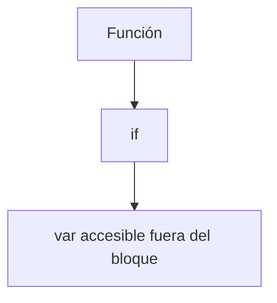
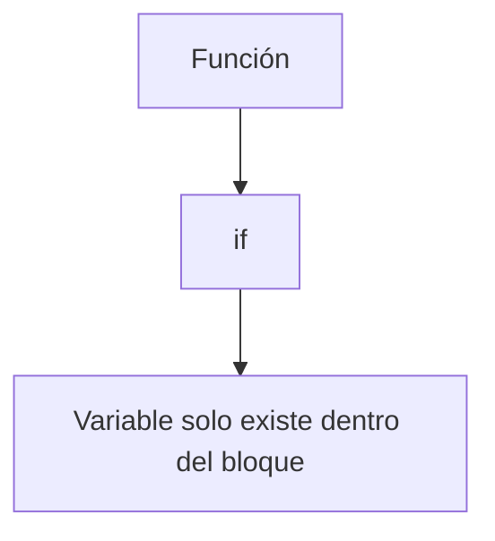
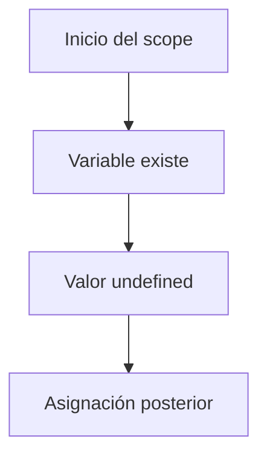
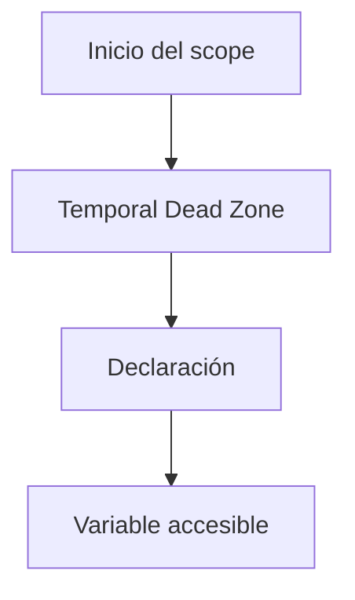

# 02. ¿Cuáles son las diferencias entre const, let y var?

## Introducción
En JavaScript, las variables son elementos fundamentales porque permiten **almacenar** **información** que puede ser **utilizada** **posteriormente** **dentro del programa**.

Gracias a las variables, los desarrolladores pueden guardar:
- números,
- textos,
- arrays,
- objetos,
- resultados de operaciones,
- e incluso funciones completas.

Sin embargo, JavaScript no dispone de una única forma de **declarar variables**. Actualmente existen tres palabras clave principales utilizadas para este propósito:
- var
- let
- const

Aunque las tres permiten almacenar información, su **comportamiento interno es diferente** y cada una posee **características** **específicas** relacionadas con:
- el alcance de las variables,
- la reasignación de valores,
- la redeclaración,
- y el funcionamiento del scope en JavaScript.

Comprender correctamente las diferencias entre **const, let y var** es extremadamente importante, ya que elegir incorrectamente una declaración puede provocar:
- errores difíciles de detectar,
- problemas de comportamiento inesperado,
- conflictos de scope,
- y código menos seguro o mantenible.

Actualmente, en JavaScript moderno, **let y const son las formas recomendadas para declarar variables**, mientras que **var** ha quedado **prácticamente obsoleto** en la mayoría de proyectos actuales.

## ¿Qué es una variable?
Una variable es un **espacio de memoria utilizado para almacenar información que puede ser utilizada, modificada o consultada posteriormente** durante la ejecución de un programa.

Por ejemplo, una variable puede almacenar:
- el nombre de un usuario,
- la edad de una persona,
- el resultado de una operación matemática,
- o una lista completa de datos.
Las variables permiten que los programas sean dinámicos y capaces de trabajar con información cambiante.

En JavaScript, las variables se declaran utilizando:
- var,
- let,
- o const.

## Declaración de variables en JavaScript
La declaración de una variable consiste en **crearla y asignarle un nombre** para poder **utilizarla posteriormente** dentro del programa.
Por ejemplo:
````js
let nombre = "Luccia";
````
En este caso:
- let es la palabra clave utilizada para declarar la variable,
- nombre es el identificador,
- y "Luccia" es el valor almacenado.
Aunque las tres palabras clave permiten declarar variables, existen diferencias muy importantes entre ellas.

## ¿Por qué existen var, let y const?
Durante los primeros años de JavaScript, únicamente existía **var**.

Sin embargo, var presentaba varios problemas relacionados con:
- el scope,
- la redeclaración,
- y comportamientos poco predecibles.

Con la llegada de ECMAScript 6 (ES6), JavaScript introdujo:
- let
- y const
como alternativas modernas y más seguras.

Estas nuevas formas de declaración ayudaron a:
- mejorar la legibilidad,
- reducir errores,
- controlar mejor el scope,
- y escribir código más mantenible.
Actualmente, **let y const** son los estándares utilizados en el desarrollo moderno de JavaScript.

## var
### ¿Qué es var?
**var** fue la primera forma de **declarar variables** en JavaScript y durante muchos años fue la única disponible. Permite:
- declarar variables,
- reasignar valores,
- y redeclarar variables dentro del mismo scope.

Aunque todavía funciona actualmente, su uso ha disminuido considerablemente debido a varios problemas relacionados con su comportamiento interno.

### Sintaxis de var
La sintaxis de **var** se utiliza para **declarar variables** dentro de JavaScript. Declarar una variable significa **crear un espacio en memoria donde el programa podrá almacenar información para utilizarla posteriormente.**

La estructura básica de var está formada por:
- la palabra clave var,
- el nombre de la variable,
- y opcionalmente un valor inicial asignado mediante el operador =.

Su sintaxis general es la siguiente:
````js
var nombreVariable = valor;
````
Cada parte de esta estructura cumple una función específica:
- var indica a JavaScript que estamos declarando una variable,
- nombreVariable representa el identificador utilizado para acceder posteriormente a esa información,
- y valor corresponde al dato almacenado dentro de la variable.

Por ejemplo:
````js
var edad = 23;
````
En este caso:
- var declara la variable,
- edad es el nombre asignado,
- y 23 es el valor almacenado.
Una vez creada, la variable podrá utilizarse posteriormente en distintas partes del programa.

Además, las variables declaradas con var pueden crearse incluso sin asignar un valor inicial:
````js
var nombre;
````
Cuando esto ocurre, JavaScript crea igualmente la variable, pero su valor inicial será:
````js
undefined
````
Esto significa que la variable existe, aunque todavía no contiene información asignada.

### Reasignación con var
Una de las características principales de **var** es que permite **modificar** el **valor almacenado en una variable después de haber sido creada**. Este proceso recibe el nombre de **reasignación**.

La **reasignación** ocurre cuando una **variable ya existente** recibe un **nuevo valor** mediante el operador **=.** Esto permite que la información almacenada **cambie** durante la **ejecución del programa**. Por ejemplo:
````js
var nombre = "Ana";

nombre = "Lucía";
````
En este caso, inicialmente la variable almacena el valor "**Ana**". Sin embargo, posteriormente el programa vuelve a utilizar la variable **nombre** para asignarle un nuevo valor: "**Lucía**". Cuando esto ocurre:
- el valor anterior es reemplazado,
- la variable sigue existiendo,
- pero ahora almacena la nueva información.

La capacidad de reasignar valores resulta muy útil en programación, ya que muchas aplicaciones trabajan constantemente con datos que **cambian** dinámicamente:
- contadores,
- resultados,
- estados,
- información del usuario,
- o datos obtenidos desde APIs.
Gracias a la reasignación, las variables pueden adaptarse continuamente a los cambios producidos durante la ejecución del programa.

### Redeclaración con var
Además de permitir **reasignación**, **var** también permite **redeclarar variables dentro del mismo scope**. La redeclaración ocurre cuando intentamos crear nuevamente una variable utilizando exactamente el mismo nombre. Por ejemplo:
````js
var ciudad = "Madrid";
var ciudad = "Barcelona";
````
En este caso, JavaScript no genera ningún error, ya que var **permite declarar varias veces la misma variable** dentro del mismo contexto. Cuando esto ocurre:
- la nueva declaración reemplaza la anterior,
- el valor original se sobrescribe,
- y la variable pasa a almacenar únicamente el último valor asignado.

Aunque este comportamiento puede parecer útil en algunos casos, también representa uno de los principales problemas de **var**. Permitir redeclaraciones aumenta considerablemente el **riesgo** de:
- sobrescribir información accidentalmente,
- generar comportamientos inesperados,
- y crear errores difíciles de detectar en aplicaciones grandes.

Precisamente por este motivo, JavaScript moderno introdujo **let y const**, que no permiten redeclarar variables dentro del mismo scope y ayudan a escribir código más seguro y predecible.

### Scope de var
Uno de los principales problemas de **var** es que posee scope de función. Esto significa que las variables declaradas con **var** no respetan correctamente los **bloques delimitados** por llaves **{}**. Por ejemplo:
````js
if(true) {
    var mensaje = "Hola";
}

console.log(mensaje);
````
Aunque la variable fue declarada dentro del bloque **if**, sigue siendo accesible fuera de él. Esto ocurre porque **var** ignora el scope de bloque.


### Problemas de var
Debido a su comportamiento, var puede provocar:
- sobrescritura accidental de variables,
- errores difíciles de depurar,
- problemas de scope,
- y código menos predecible.
Por este motivo, actualmente se recomienda evitar su uso en proyectos modernos.

## let
### ¿Qué es let?
**let** es una forma moderna de **declarar variables** introducida en ES6.

Fue creada para solucionar muchos de los problemas que presentaba **var**, especialmente aquellos relacionados con el scope y la redeclaración. Las variables declaradas con let:
- pueden reasignarse,
- pero no pueden redeclararse dentro del mismo scope.

### Sintaxis de let
La sintaxis de **let** se utiliza para **declarar variables** dentro de JavaScript de una forma más moderna y segura que var. Al igual que otras declaraciones de variables, la estructura de **let** está formada por:
- la palabra clave let,
- el nombre de la variable,
- y opcionalmente un valor inicial asignado mediante el operador =.

La sintaxis general es la siguiente:
````js
let nombreVariable = valor;
````
Cada parte cumple una función concreta:
- let indica que estamos creando una variable con scope de bloque,
- nombreVariable representa el identificador utilizado para acceder posteriormente a la información,
- y valor corresponde al dato almacenado dentro de la variable.

Por ejemplo:
````js
let edad = 23;
````
En este caso:
- let declara la variable,
- edad es el nombre asignado,
- y 23 es el valor almacenado.

Al igual que ocurre con *var*, también es posible declarar variables sin asignarles un valor inicial:
````js
let nombre;
````
Cuando esto ocurre, JavaScript crea igualmente la variable, pero su valor inicial será:
````js
undefined
````
La principal diferencia respecto a var no se encuentra en la sintaxis, sino en el **comportamiento relacionado** con:
- el scope,
- la redeclaración,
- y la seguridad del código.

### Reasignación con let
Las variables declaradas con **let** permiten **modificar posteriormente el valor almacenado en ellas**. Este proceso recibe el nombre de **reasignación**.

La **reasignación** ocurre cuando una **variable ya existente recibe un nuevo valor mediante el operador =**. Por ejemplo:
````js
let nombre = "Ana";

nombre = "Lucía";
````
En este caso, inicialmente la variable almacena el valor "**Ana**".

Posteriormente, el programa asigna un nuevo valor a la misma variable, reemplazando el contenido anterior por "**Lucía**". Cuando esto ocurre:
- la variable sigue existiendo,
- pero ahora almacena la nueva información.

La capacidad de reasignar variables resulta especialmente útil cuando trabajamos con datos que cambian constantemente durante la ejecución del programa, como:
- contadores,
- resultados,
- estados,
- validaciones,
- o información introducida por el usuario.
Precisamente por este motivo, let suele utilizarse cuando sabemos que el valor de una variable necesitará modificarse posteriormente.

### Redeclaración con let
A diferencia de var, las variables declaradas con **let** **NO** pueden redeclararse dentro del mismo scope.

La redeclaración ocurre cuando intentamos crear nuevamente una variable utilizando exactamente el mismo nombre. Por ejemplo:
````js
let ciudad = "Madrid";
let ciudad = "Barcelona";
````
En este caso, JavaScript **generará un error**. Esto ocurre porque **let** **impide redeclarar variables dentro del mismo contexto** para evitar:
- sobrescrituras accidentales,
- conflictos entre datos,
- y errores difíciles de detectar.

Gracias a esta restricción, el código resulta:
- más seguro,
- más predecible,
- y mucho más fácil de mantener.

Sin embargo, sí es posible utilizar el mismo nombre de variable dentro de scopes distintos. Por ejemplo, una variable declarada dentro de un bloque **{} **puede coexistir con otra fuera de él, ya que pertenecen a contextos diferentes.

### Scope de let
A diferencia de var, **let** posee scope de bloque. Esto significa que la variable **solo existe dentro del bloque donde fue creada**.
````js
if(true) {
    let mensaje = "Hola";
}

console.log(mensaje);
````
En este caso, JavaScript generará un **error** porque **la variable no existe fuera del bloque if**.

### Ventajas de let
let ofrece numerosas ventajas:
- mayor control del scope,
- menos errores accidentales,
- mejor legibilidad,
- y comportamiento más predecible.
Por este motivo, es una de las formas más utilizadas actualmente para declarar variables que necesitan cambiar de valor.

## const
### ¿Qué es const?
**const** también fue introducido en ES6 y se utiliza para **declarar variables cuyo valor no debe reasignarse posteriormente**.

A diferencia de **let**, las variables declaradas con **const**:
- no pueden reasignarse,
- ni redeclararse.
Esto permite crear código más **seguro y predecible**.

### Sintaxis de const
La sintaxis de **const** se utiliza para **declarar variables cuyo valor no debe reasignarse posteriormente**.

Al igual que **let y var**, la estructura está formada por:
- la palabra clave const,
- el nombre de la variable,
- y un valor asignado mediante el operador =.

Su sintaxis general es la siguiente:
````js
const nombreVariable = valor;
````
Por ejemplo:
````js
const PI = 3.14;
````
En este caso:
- const declara la variable,
- PI es el identificador,
- y 3.14 es el valor almacenado.

A diferencia de var y let, las variables declaradas con **const** deben **recibir obligatoriamente un valor inicial** en el momento de su creación. Por ejemplo:
````js
const nombre;
````
provocará un **error** porque JavaScript **necesita conocer el valor constante desde el inicio**. Esto ocurre porque **const** está diseñado para trabajar con **referencias** que **no deben cambiar posteriormente**.

### Reasignación con const
Las variables declaradas con const **NO permiten reasignar valores posteriormente**. Esto significa que, una vez creada la variable, su referencia **no puede modificarse**. Por ejemplo:
```js
const nombre = "Ana";

nombre = "Lucía";
```
En este caso, JavaScript generará un error porque estamos intentando reemplazar el valor original de la variable. Cuando utilizamos const, el valor asignado durante la declaración permanece asociado a esa variable durante toda la ejecución del programa.

Gracias a esto:
- el código se vuelve más seguro,
- se reducen errores accidentales,
- y el comportamiento del programa resulta más predecible.
Por este motivo, muchos desarrolladores utilizan const por defecto y únicamente recurren a let cuando realmente necesitan modificar valores posteriormente.

### Redeclaración con const
Al igual que ocurre con **let**, las variables declaradas con **const** tampoco pueden redeclararse dentro del mismo scope. Por ejemplo:
```js
const ciudad = "Madrid";
const ciudad = "Barcelona";
```
Este código generará un error porque JavaScript **no permite crear dos constantes con el mismo nombre dentro del mismo contexto**. Esta restricción ayuda a evitar:
- conflictos entre variables,
- sobrescrituras accidentales,
- y errores difíciles de detectar.

Gracias a este comportamiento, const permite escribir código:
- más organizado,
- más seguro,
- y más fácil de mantener.
Sin embargo, igual que ocurre con let, sí es posible utilizar el mismo identificador en scopes diferentes, ya que pertenecen a contextos distintos dentro del programa.

### Scope de const
Al igual que **let**, **const** posee **scope de bloque**. Esto significa que **únicamente existe dentro del bloque donde fue declarada**.



### ¿const hace los valores inmutables?
Uno de los errores más comunes consiste en pensar que **const** vuelve completamente **inmutable el contenido de una variable**.
En realidad, **const** únicamente **impide reasignar la referencia de la variable**. Por ejemplo:
````js
const usuario = {
    nombre: "Ana"
};

usuario.nombre = "Lucía";
````
Esto es válido porque no estamos reemplazando el objeto completo, sino modificando una propiedad interna. Sin embargo:
````js
usuario = {};
````
sí provocaría un error.

### ¿Cuándo utilizar const?
Actualmente, muchos desarrolladores utilizan **const** por defecto y únicamente recurren a **let** cuando saben que la variable necesitará cambiar de valor posteriormente.

Esto ayuda a:
- reducir errores,
- escribir código más seguro,
- y dejar más clara la intención del desarrollador.

### Diferencias entre var, let y const
Aunque las tres palabras clave permiten declarar variables, sus diferencias internas afectan enormemente al comportamiento del programa. Las principales diferencias se relacionan con:
- la reasignación,
- la redeclaración,
- y el scope.

| Característica              | var              | let                 | const            |
| --------------------------- | ------------------ | --------------------- | ------------------ |
| Reasignación                | Sí                 | Sí                    | No                 |
| Redeclaración               | Sí                 | No                    | No                 |
| Scope de bloque             | No                 | Sí                    | Sí                 |
| Scope de función            | Sí                 | No                    | No                 |
| Uso recomendado actualmente | No                 | Sí                    | Sí                 |
| Riesgo de errores           | Alto               | Medio                 | Bajo               |
| Introducido en              | JavaScript clásico | ES6                   | ES6                |
| Uso principal               | Código antiguo     | Variables que cambian | Valores constantes |


### Buenas prácticas al declarar variables
Cuando trabajamos con variables en JavaScript, es recomendable:
- utilizar const por defecto,
- usar let únicamente cuando el valor necesite cambiar,
- y evitar var en proyectos modernos.

También es importante:
- utilizar nombres descriptivos,
- mantener scopes organizados,
- y evitar redeclaraciones innecesarias.

### Errores comunes
**Pensar que const vuelve todo inmutable.**
Muchos principiantes creen que const impide modificar completamente arrays u objetos. Sin embargo, únicamente impide reasignar la variable, no modificar el contenido interno del objeto o array.

**Utilizar var sin comprender el scope**
Otro error muy frecuente consiste en **utilizar var sin entender cómo funciona su scope de función**. Esto puede provocar:
- variables accesibles donde no deberían,
- conflictos entre datos,
- y errores difíciles de detectar.

### Conclusión
**var, let y const** son las tres formas principales de declarar variables en JavaScript, pero poseen comportamientos muy diferentes relacionados con:
- el scope,
- la reasignación,
- y la redeclaración.
Mientras que var pertenece al JavaScript clásico y presenta varios problemas relacionados con el scope, let y const ofrecen alternativas modernas mucho más seguras y organizadas.

Comprender correctamente sus diferencias es fundamental para escribir código limpio, eficiente y mantenible dentro del desarrollo moderno en JavaScript.

## Hoisting en JavaScript
Uno de los conceptos más importantes relacionados con var, let y const es el **hoisting**.

El **hoisting** es un **comportamiento interno** de JavaScript mediante el cual las **declaraciones de variables y funciones son “elevadas” automáticamente al inicio de su contexto antes de que el código se ejecute**. Esto no significa que el código se mueva físicamente de lugar, sino que JavaScript procesa primero ciertas declaraciones durante la fase de compilación.

Debido a este comportamiento, algunas variables pueden utilizarse antes de haber sido declaradas explícitamente en el código. Sin embargo, el comportamiento del hoisting cambia dependiendo de si utilizamos:
- var,
- let,
- o const.
Precisamente aquí aparece una de las diferencias más importantes entre estas formas de declarar variables.

## Hoisting con var
Las variables declaradas con **var** son elevadas automáticamente al inicio de su scope. Por ejemplo:
````js
console.log(nombre);

var nombre = "Luccia";
````
Aunque la variable se declara después del **console.log()**, JavaScript **no genera un error**. Esto ocurre porque internamente interpreta el código de una forma similar a esta:
````js
var nombre;

console.log(nombre);

nombre = "Luccia";
````
Como consecuencia, la variable existe desde el inicio, pero inicialmente contiene el valor:
````js
undefined
````
Este comportamiento puede generar:
- confusión,
- errores difíciles de detectar,
- y comportamientos inesperados.


## Hoisting con let y const
Las variables declaradas con **let y const** también son elevadas internamente, pero funcionan de manera diferente a var.

Por ejemplo:
````js
console.log(nombre);

let nombre = "Luccia";
````
En este caso, JavaScript **sí genera un error**. Aunque la variable existe internamente durante la fase de compilación, no puede utilizarse antes de su declaración.

Esto ocurre debido a un comportamiento conocido como:
**Temporal Dead Zone (TDZ)**

## ¿Qué es la Temporal Dead Zone (TDZ)?
La **Temporal Dead Zone**, también conocida como **TDZ**, es el **período de tiempo existente** entre:
- el inicio del scope,
- y el momento en que la variable es declarada.

Durante ese intervalo:
- la variable existe internamente,
- pero no puede accederse a ella.

Si el programa intenta utilizar una variable declarada con let o const antes de su declaración, JavaScript generará automáticamente un error. Este comportamiento fue diseñado para:
- evitar errores accidentales,
- mejorar la seguridad del código,
- y hacer el comportamiento de las variables más predecible.

## Diferencia entre el hoisting de var, let y const
Aunque **var, let y const** participan en el proceso de **hoisting** de JavaScript, cada una se comporta de manera diferente durante la fase de compilación del código.

La principal diferencia se encuentra en cómo JavaScript **permite acceder a las variables antes de su declaración y en el estado en el que dichas variables existen internamente al comenzar el scope**.

Mientras que **var permite acceder a la variable antes de declararla** —aunque inicialmente su valor sea undefined—, **let y const permanecen bloqueadas dentro de la Temporal Dead Zone (TDZ)**, impidiendo cualquier acceso hasta que la declaración haya sido ejecutada correctamente.

Estas diferencias afectan directamente a:
- la seguridad del código,
- la prevención de errores,
- y el comportamiento general de las variables dentro de una aplicación JavaScript.

| Declaración | ¿Existe antes de declararse? | ¿Puede utilizarse antes de declararse? | Valor inicial |
| ----------- | ---------------------------- | -------------------------------------- | ------------- |
| var       | Sí                           | Sí                                     | undefined   |
| let       | Sí                           | No                                     | TDZ           |
| const     | Sí                           | No                                     | TDZ           |

## ¿Por qué es importante comprender el hoisting?
Comprender correctamente el hoisting ayuda a entender:
- cómo interpreta JavaScript el código internamente,
- por qué aparecen ciertos errores,
- y cómo funciona realmente el scope de las variables.

Además, entender este comportamiento permite:
- escribir código más seguro,
- evitar errores difíciles de detectar,
- y comprender mejor el funcionamiento interno del lenguaje.
Por este motivo, el hoisting es considerado uno de los conceptos fundamentales de JavaScript moderno.

## ¿Cuál debería utilizar actualmente?
En JavaScript moderno, la recomendación general es:
- utilizar const por defecto,
- utilizar let únicamente cuando el valor necesite cambiar,
- y evitar var salvo en proyectos antiguos o casos específicos.

Este enfoque ayuda a escribir código:
- más seguro,
- más mantenible,
- y mucho más predecible.
