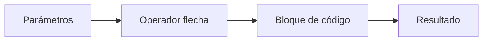
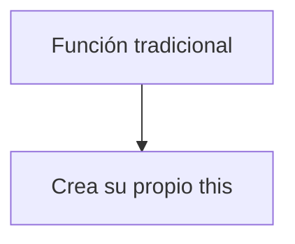
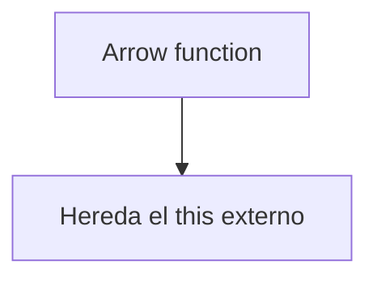

# 03. ¿Qué es una función de flecha?

## Introducción
Las funciones son uno de los pilares fundamentales de JavaScript. Gracias a ellas, los desarrolladores pueden **agrupar instrucciones dentro de bloques reutilizables** capaces de ejecutar tareas específicas cuando sea necesario.

Sin las funciones, los programas modernos serían extremadamente **difíciles de organizar, mantener y reutilizar**. Cada vez que una aplicación:
- valida datos,
- procesa información,
- responde a eventos,
- realiza cálculos,
- o ejecuta acciones automáticas,
- probablemente esté utilizando funciones internamente.

Durante muchos años, JavaScript únicamente permitió crear funciones mediante la sintaxis tradicional basada en la palabra clave:
````js
function
````
Sin embargo, con la llegada de ECMAScript 6 (ES6), el lenguaje introdujo una nueva forma moderna de **declarar funciones** conocida como:
**función de flecha o arrow function**.

Las arrow functions fueron creadas para:
- simplificar la escritura de funciones,
- reducir la cantidad de código necesaria,
- mejorar la legibilidad,
- y facilitar ciertos comportamientos relacionados con this.

Actualmente forman parte esencial del JavaScript moderno y son utilizadas constantemente en:
- callbacks,
- programación funcional,
- métodos de arrays,
- frameworks como React o Vue,
- aplicaciones Node.js,
- y desarrollo frontend moderno en general.
Comprender correctamente cómo funcionan las funciones de flecha es fundamental para leer, entender y escribir JavaScript moderno de forma profesional.

## ¿Qué es una función de flecha?
Una función de flecha es una forma moderna y simplificada de **declarar funciones** en JavaScript. Reciben este nombre debido al uso del operador:
````js
=>
````
conocido como:
**arrow operator u operador flecha.**

Este operador separa:
- los parámetros de entrada,
- del bloque de instrucciones que ejecutará la función.

A diferencia de las funciones tradicionales, las arrow functions fueron diseñadas para permitir una sintaxis:
- más compacta,
- más limpia,
- y mucho más fácil de leer.

Además de la reducción visual del código, también presentan diferencias importantes relacionadas con:
- el comportamiento de this,
- el scope,
- el retorno implícito,
- y la forma en la que JavaScript maneja el contexto interno de ejecución.
Por este motivo, las funciones de flecha no son simplemente “una forma más corta de escribir funciones”, sino una característica moderna del lenguaje con comportamientos propios y aplicaciones específicas.

## ¿Por qué se introdujeron las arrow functions?
Antes de ES6, muchas funciones pequeñas requerían escribir una sintaxis relativamente **extensa**. Incluso operaciones simples necesitaban:
- la palabra function,
- llaves {},
- paréntesis,
- y frecuentemente la palabra return.

Esto hacía que muchos fragmentos de código:
- ocuparan más espacio del necesario,
- fueran más difíciles de leer,
- y resultaran visualmente más pesados.

Por ejemplo, al trabajar con:
- callbacks,
- métodos de arrays,
- temporizadores,
- o programación funcional,
era muy común escribir funciones extremadamente pequeñas usando una sintaxis larga y repetitiva.

Las arrow functions fueron introducidas para resolver este problema y permitir escribir funciones:
- más rápidas de crear,
- más legibles,
- y más expresivas.

Además, también ayudaron a solucionar muchos problemas relacionados con el comportamiento de **this** en funciones **anidadas y callbacks**. Gracias a esto, las arrow functions se convirtieron rápidamente en una de las características más utilizadas del JavaScript moderno.

## Sintaxis de una función de flecha
La sintaxis de las arrow functions está diseñada para **simplificar** la **declaración de funciones** y **reducir la cantidad de código necesario para escribirlas**. A diferencia de las funciones tradicionales, las arrow functions no utilizan la palabra clave:
````js
function
````
En su lugar, emplean el operador:
````js
=>
````
La estructura general es la siguiente:
````js
const nombreFuncion = (parametros) => {
    // código
};
````
Cada parte de esta estructura cumple una función específica:
- const almacena la función dentro de una variable,
- nombreFuncion representa el identificador utilizado para llamar posteriormente a la función,
- (parametros) contiene los datos que la función puede recibir,
- y el bloque {} agrupa las instrucciones que ejecutará la función.

El operador flecha:
````js
=>
````
es el elemento visual más característico de este tipo de funciones. Gracias a esta sintaxis, JavaScript permite escribir funciones mucho más **compactas y legibles**.



## Ejemplo básico de arrow function
````js
const saludar = () => {
    console.log("Hola");
};
````
En este ejemplo:
- la función se almacena dentro de la variable saludar,
- no recibe parámetros,
- y ejecuta un mensaje en consola cuando es llamada.
Aunque el ejemplo es simple, permite observar claramente la estructura básica de una función de flecha.

Cuando JavaScript ejecuta esta función:
- accede a la variable saludar,
- interpreta el bloque de código,
- y ejecuta las instrucciones contenidas dentro de las llaves.

## Arrow functions con parámetros
Las funciones de flecha también pueden recibir **información externa mediante parámetros**.
````js
const saludar = (nombre) => {
    console.log("Hola " + nombre);
};
````
En este caso:
- nombre actúa como parámetro,
- la función recibe un dato externo,
- y utiliza ese valor dentro del bloque de instrucciones.
Los parámetros permiten crear funciones dinámicas capaces de trabajar con información variable.

Por ejemplo:
- nombres,
- números,
- arrays,
- objetos,
- o cualquier dato que necesite procesarse.
Gracias a esto, las funciones pueden reutilizarse múltiples veces con resultados distintos.

## Arrow functions con varios parámetros
Cuando una función necesita **recibir varios datos**, los parámetros se **separan mediante comas**.
````js
const sumar = (a, b) => {
    return a + b;
};
````
En este caso:
- a y b representan dos valores distintos,
- la función recibe ambos datos,
- y devuelve el resultado de la suma.
Las arrow functions permiten trabajar con **múltiples parámetros** exactamente igual que las **funciones tradicionales**.

## Retorno implícito en arrow functions
Una de las características más importantes de las arrow functions es el **retorno implícito**. Cuando la función contiene únicamente una expresión simple, JavaScript puede devolver automáticamente el **resultado** sin necesidad de utilizar:
- llaves {},
- ni la palabra clave return.

Por ejemplo:
````js
const multiplicar = (a, b) => a * b;
````
En este caso:
- la función recibe dos parámetros,
- realiza la multiplicación,
- y devuelve automáticamente el resultado.

Aunque no aparece la palabra:
````js
return
````
JavaScript entiende internamente que debe devolver el resultado de la operación. Esto permite escribir **funciones pequeñas** de forma extremadamente compacta.

## Diferencia entre retorno explícito e implícito
**Retorno explícito**
````js
const sumar = (a, b) => {
    return a + b;
};
````
**Retorno implícito**
````js
const sumar = (a, b) => a + b;
````
Ambas funciones realizan exactamente la misma tarea. La diferencia es que el retorno implícito **elimina código innecesario** y simplifica la sintaxis.

## Diferencia entre función tradicional y arrow function
Las funciones tradicionales y las arrow functions pueden realizar tareas similares, pero poseen diferencias importantes relacionadas con:
- sintaxis,
- comportamiento interno,
- y manejo del contexto this.

**Función tradicional**
````js
function saludar(nombre) {
    return "Hola " + nombre;
}
````
**Arrow function**
````js
const saludar = (nombre) => {
    return "Hola " + nombre;
};
````
Ambas funciones realizan exactamente la misma tarea. Sin embargo, la arrow function:
- utiliza una sintaxis más moderna,
- reduce la cantidad de código,
- y facilita la lectura en muchas situaciones.

| Característica     | Función tradicional | Arrow function               |
| ------------------ | ------------------- | ---------------------------- |
| Sintaxis           | Más extensa         | Más compacta                 |
| Uso de function  | Sí                  | No                           |
| Uso de =>        | No                  | Sí                           |
| return implícito | No                  | Sí                           |
| Propio this      | Sí                  | No                           |
| Uso moderno        | Menos frecuente     | Muy utilizado actualmente    |
| Legibilidad        | Media               | Alta                         |
| Uso habitual       | Funciones generales | Callbacks y funciones cortas |

## El comportamiento de this en arrow functions
Una de las diferencias más importantes de las funciones de flecha está relacionada con: **this**

En JavaScript, **this** representa el **contexto** desde el cual una **función está siendo ejecutada**. Las funciones tradicionales crean su propio contexto **this**.

Sin embargo, las arrow functions **NO** crean un nuevo **this**, sino que **heredan automáticamente** el contexto del lugar donde fueron creadas. Este comportamiento recibe el nombre de: **lexical this**

Gracias a esto, las arrow functions resultan extremadamente útiles en:
- callbacks,
- funciones anidadas,
- temporizadores,
- eventos,
- y programación asíncrona.

## Flujo visual del this
**Función tradicional**

**Arrow function**

## ¿Cuándo utilizar arrow functions?
Las arrow functions resultan especialmente útiles cuando:
- necesitamos funciones pequeñas,
- trabajamos con callbacks,
- utilizamos métodos como map() o forEach(),
- o queremos escribir código más limpio y compacto.

Actualmente son extremadamente comunes en:
- React,
- Vue,
- Node.js,
- y desarrollo moderno en general.

## ¿Cuándo NO utilizar arrow functions?
Aunque son muy útiles, existen situaciones donde las funciones tradicionales siguen siendo más apropiadas. Por ejemplo:
- métodos complejos de objetos,
- constructores,
- o funciones que necesitan gestionar su propio this.
En estos casos, utilizar arrow functions puede provocar comportamientos inesperados.

## Ventajas de las arrow functions
Las funciones de flecha ofrecen numerosas ventajas:
- sintaxis moderna y compacta,
- menor cantidad de código,
- mejor legibilidad,
- retorno implícito,
- y manejo simplificado de this.
Además, permiten escribir código mucho más expresivo y fácil de mantener.

## Desventajas de las arrow functions
A pesar de sus ventajas, también presentan ciertas limitaciones. Las arrow functions:
- no poseen su propio this,
- no funcionan correctamente como constructores,
- y pueden resultar problemáticas en algunos métodos de objetos.
Además, abusar de funciones excesivamente compactas puede dificultar la comprensión del código.

## Buenas prácticas al utilizar arrow functions
Cuando trabajamos con funciones de flecha, es recomendable:
- utilizarlas en callbacks y funciones pequeñas,
- aprovechar el retorno implícito cuando el código sea sencillo,
- mantener una sintaxis clara y legible,
- y evitar utilizarlas en situaciones donde necesitemos un this dinámico.
También es importante no abusar de sintaxis demasiado reducidas si afectan negativamente a la claridad del código.

## Conclusión
Las funciones de flecha son una de las características más importantes introducidas en JavaScript moderno mediante ES6.

Gracias a su sintaxis compacta, su retorno implícito y su comportamiento especial con this, permiten escribir código:
- más limpio,
- más moderno,
- y mucho más mantenible.
Actualmente forman parte esencial del desarrollo moderno en JavaScript y son utilizadas constantemente en frameworks, callbacks y programación funcional.

Comprender correctamente cómo funcionan las arrow functions es fundamental para desarrollar aplicaciones modernas y entender gran parte del ecosistema actual de JavaScript.
