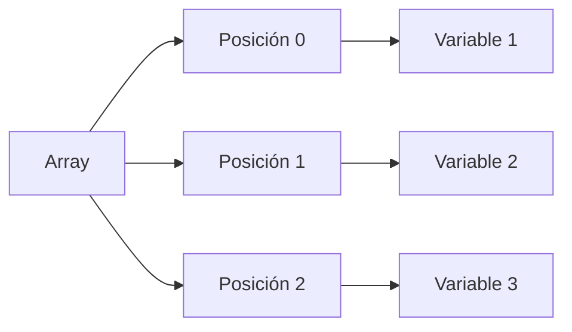
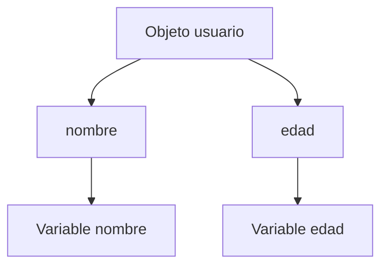

# 04. ¿Qué es la deconstrucción de variables?

## Introducción
En JavaScript moderno, es muy común trabajar con estructuras que **almacenan grandes cantidades de información**, como:
- arrays,
- objetos,
- respuestas de APIs,
- configuraciones,
- o datos provenientes de formularios.

Tradicionalmente, para acceder a la información contenida dentro de estas estructuras era necesario hacerlo **manualmente**, accediendo elemento por elemento o propiedad por propiedad. Sin embargo, este proceso podía resultar:
- repetitivo,
- poco práctico,
- y difícil de leer en aplicaciones grandes.

Para solucionar este problema, JavaScript introdujo una característica conocida como:
**deconstrucción de variables (*destructuring*).**

La deconstrucción permite **extraer datos** de arrays y objetos de una forma mucho más rápida, limpia y organizada. Gracias a esta característica, los desarrolladores pueden:
- acceder fácilmente a valores internos,
- simplificar el código,
- mejorar la legibilidad,
- y trabajar de manera mucho más eficiente con estructuras complejas de datos.

Actualmente, la deconstrucción es una de las características más utilizadas del JavaScript moderno y aparece constantemente en:
- React,
- Node.js,
- funciones,
- manejo de APIs,
- programación funcional,
- y desarrollo frontend moderno.
Comprender correctamente cómo funciona el destructuring es fundamental para escribir código moderno, limpio y profesional en JavaScript.

## ¿Qué es la deconstrucción de variables?
La deconstrucción de variables, también conocida como: **destructuring**

Es una característica de JavaScript que permite **extraer valores o propiedades** de arrays y objetos de una forma rápida y simplificada. En lugar de acceder manualmente a cada dato utilizando:
- índices,
- propiedades,
- o múltiples líneas de código,
la deconstrucción permite **“desempaquetar”** directamente la información y **almacenarla** automáticamente en **variables individuales**.

Esto hace que el código sea:
- más limpio,
- más corto,
- más legible,
- y mucho más fácil de mantener.

La deconstrucción puede utilizarse principalmente con:
- arrays,
- objetos,
- parámetros de funciones,
- resultados de funciones,
- y respuestas de APIs.
Gracias a esta característica, JavaScript permite trabajar de manera mucho más eficiente con estructuras de datos complejas.

## ¿Por qué se introdujo el destructuring?
Antes de la llegada de ES6, extraer datos de arrays y objetos requería escribir mucho código repetitivo. Por ejemplo, si un objeto contenía varias propiedades, era necesario acceder manualmente a cada una de ellas. Esto provocaba:
- código más largo,
- menor legibilidad,
- y mayor dificultad de mantenimiento.

El destructuring fue introducido para:
- simplificar el acceso a datos,
- reducir código innecesario,
- mejorar la organización,
- y facilitar el trabajo con estructuras complejas.
Gracias a esto, JavaScript moderno permite manipular información de una forma mucho más clara y expresiva.

## Deconstrucción de arrays
### ¿Qué es la deconstrucción de arrays?
La deconstrucción de arrays permite extraer automáticamente elementos internos de un array y almacenarlos directamente dentro de variables individuales. En lugar de acceder manualmente mediante índices como:
```js
array[0]
```
JavaScript puede **asignar automáticamente cada posición a una variable concreta**. Esto simplifica enormemente el trabajo con arrays.

### Sintaxis de la deconstrucción de arrays
La sintaxis utiliza corchetes **[]** porque estamos trabajando con arrays. La estructura general es la siguiente:
```js
const [variable1, variable2] = array;
```
Cada variable recibe automáticamente el valor correspondiente según su posición dentro del array.

### Ejemplo básico de destructuring con arrays
```js
const colores = ["Rojo", "Azul", "Verde"];

const [color1, color2, color3] = colores;
```

En este ejemplo:
- color1 recibe "Rojo",
- color2 recibe "Azul",
- y color3 recibe "Verde".
JavaScript realiza automáticamente la asignación basándose en la posición de cada elemento dentro del array.


### Saltar elementos en arrays
La deconstrucción también permite **ignorar posiciones específicas** del array.
```js
const numeros = [10, 20, 30];

const [primero, , tercero] = numeros;
```
En este caso:
- primero recibe 10,
- el segundo valor es ignorado,
- y tercero recibe 30.
Esto resulta muy útil cuando únicamente necesitamos **ciertos elementos concretos**.

### Valores por defecto en arrays
También es posible** asignar valores por defecto** en caso de que el array no contenga suficientes elementos.
```js
const [nombre = "Invitado"] = [];
```
En este ejemplo:
- el array está vacío,
- no existe ningún valor disponible,
- por lo que JavaScript utiliza automáticamente "Invitado".

## Deconstrucción de objetos
### ¿Qué es la deconstrucción de objetos?
La deconstrucción de objetos permite **extraer propiedades internas de un objeto y almacenarlas automáticamente dentro de variables**.
A diferencia de los arrays, aquí la asignación no depende de la posición, sino del **nombre de las propiedades**. Esto hace que el destructuring de objetos sea **extremadamente flexible**.

### Sintaxis de la deconstrucción de objetos
La sintaxis utiliza llaves **{}** porque estamos trabajando con objetos. La estructura general es la siguiente:
```js
const { propiedad } = objeto;
```
JavaScript busca automáticamente una **propiedad** con ese **nombre dentro del objeto** y **asigna** su **valor** a la **variable correspondiente**.

### Ejemplo básico de destructuring con objetos
```js
const usuario = {
    nombre: "Luccia",
    edad: 23
};

const { nombre, edad } = usuario;
```

En este caso:
- la variable nombre recibe "Luccia",
- y la variable edad recibe 23.
JavaScript extrae automáticamente las propiedades del objeto utilizando sus nombres.


### Cambiar el nombre de variables
La deconstrucción de objetos también permite **renombrar variables durante la extracción**.
```js
const usuario = {
    nombre: "Luccia"
};

const { nombre: usuarioNombre } = usuario;
```
En este caso:
- la propiedad original sigue llamándose nombre,
- pero el valor se almacena en la variable usuarioNombre.
Esto resulta útil para evitar conflictos entre variables.

### Valores por defecto en objetos
También es posible **asignar valores por defecto cuando una propiedad no existe**.
```js
const usuario = {};

const { nombre = "Invitado" } = usuario;
```
Como el objeto no contiene la propiedad nombre, JavaScript utiliza automáticamente el **valor por defecto**.

## Destructuring en funciones
La deconstrucción también puede utilizarse directamente en los parámetros de una función.
```js
const mostrarUsuario = ({ nombre, edad }) => {
    console.log(nombre, edad);
};
```
En este caso:
- la función recibe un objeto,
- JavaScript extrae automáticamente las propiedades,
- y las variables quedan disponibles directamente dentro de la función.

Este patrón es extremadamente común en:
- React,
- manejo de APIs,
- configuración de funciones,
- y desarrollo moderno en general.

## Ventajas del destructuring
La deconstrucción ofrece numerosas ventajas:
- código más limpio,
- menos repetición,
- mayor legibilidad,
- acceso rápido a datos,
- y mejor organización del código.

Además, simplifica enormemente el trabajo con:
- arrays complejos,
- objetos anidados,
- y respuestas de APIs.

## Desventajas del destructuring
Aunque es muy útil, también presenta algunas limitaciones. Cuando se utiliza **excesivamente** sobre estructuras muy complejas, el código puede volverse:
- difícil de leer,
- confuso,
- o complicado de mantener.
Además, si las propiedades esperadas no existen y no se controlan correctamente, pueden aparecer valores:
```js
undefined
```

## Diferencia entre destructuring de arrays y objetos
Aunque ambos utilizan el mismo concepto de extracción de datos, funcionan de forma diferente.

| Característica      | Arrays          | Objetos                   |
| ------------------- | --------------- | ------------------------- |
| Símbolos utilizados | []            | {}                      |
| Basado en           | Posición        | Nombre de propiedad       |
| Orden importante    | Sí              | No                        |
| Flexibilidad        | Media           | Alta                      |
| Uso habitual        | Listas de datos | Configuraciones y objetos |

## Buenas prácticas al utilizar destructuring
Cuando trabajamos con destructuring, es recomendable:
- utilizar nombres claros y descriptivos,
- evitar destructuring excesivamente complejo,
- usar valores por defecto cuando sea necesario,
- y mantener el código legible.
También es importante no abusar de destructuring anidados si dificultan la comprensión del programa.

## ¿Cuándo utilizar destructuring?
El destructuring resulta especialmente útil cuando:
- trabajamos con objetos grandes,
- consumimos APIs,
- utilizamos React,
- necesitamos acceder rápidamente a múltiples propiedades,
- o queremos simplificar código repetitivo.
Actualmente es una de las características más utilizadas del JavaScript moderno.

## Conclusión
La deconstrucción de variables es una característica fundamental de JavaScript moderno que permite extraer datos de arrays y objetos de una forma mucho más rápida, limpia y organizada.

Gracias al destructuring, los desarrolladores pueden escribir código:
- más legible,
- más compacto,
- más mantenible,
- y mucho más eficiente al trabajar con estructuras complejas de datos.

Actualmente forma parte esencial del desarrollo moderno en JavaScript y aparece constantemente en frameworks, APIs y aplicaciones profesionales.

