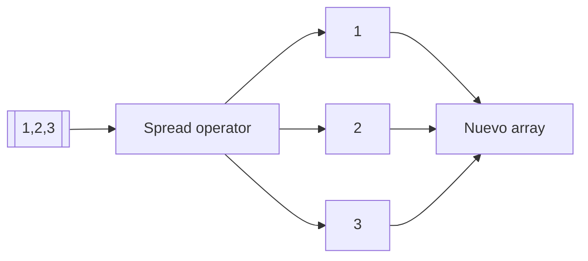
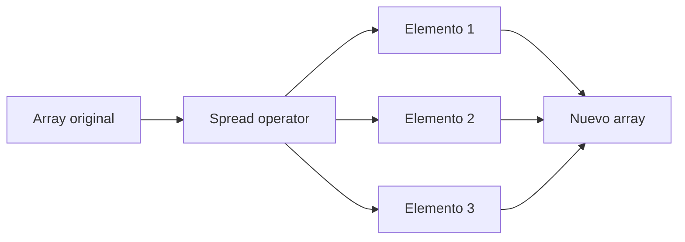
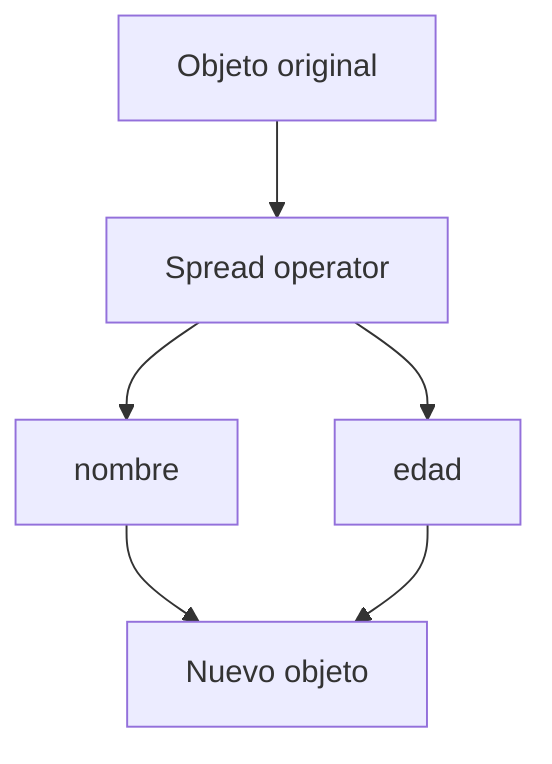

# 05. ¿Qué hace el operador de extensión en JS?

## Introducción
El operador de extensión, también conocido como: **spread operator**, es una característica de JavaScript que permite **expandir** automáticamente los **elementos internos** de una **estructura iterable dentro de otra estructura**.

Su sintaxis está formada por tres puntos consecutivos:
```js
...
```
Aunque visualmente parece un operador muy simple, internamente posee un comportamiento **extremadamente potente**.

Cuando JavaScript encuentra el **spread operator**, toma automáticamente los elementos internos de una estructura y los **distribuye individualmente** en el nuevo lugar donde se está utilizando el operador. Esto significa que una estructura como un array deja de tratarse como un **único bloque de información** y pasa a convertirse en **múltiples elementos independientes**.

Gracias a este comportamiento, el **spread operator** permite realizar operaciones muy comunes de una forma muchísimo más sencilla y legible. Por ejemplo, copiar arrays, combinar estructuras, insertar nuevos valores o enviar argumentos dinámicamente a funciones puede hacerse utilizando una sintaxis extremadamente compacta.

Actualmente, el spread operator es una de las herramientas más utilizadas del JavaScript moderno debido a la claridad y flexibilidad que aporta al código.

## ¿Por qué se introdujo el spread operator?
Antes de ES6, muchas operaciones relacionadas con arrays y objetos requerían escribir **bastante código repetitivo**. Acciones tan comunes como combinar arrays, copiar estructuras o actualizar objetos necesitaban métodos más largos, bucles manuales o procesos menos intuitivos.

Esto hacía que muchas operaciones simples terminaran generando código **difícil de leer y complicado de mantener**, especialmente en aplicaciones grandes.

El **spread operator** fue introducido precisamente para resolver este problema. Gracias a esta característica, JavaScript moderno permite manipular estructuras de datos utilizando una sintaxis mucho más clara, compacta y expresiva.

Además de reducir la cantidad de código necesaria, el spread operator también mejora enormemente la legibilidad, ya que hace mucho más evidente qué está ocurriendo internamente durante la manipulación de datos.

## Sintaxis del operador de extensión
La sintaxis del spread operator utiliza tres puntos consecutivos:
```js
...
```
Su estructura básica suele verse de la siguiente manera:
```js
const nuevoArray = [...array];
```
En este caso, el **operador de extensión** toma automáticamente **todos los elementos** contenidos dentro de array y los **expande individualmente** dentro del nuevo array.

Aunque externamente parezca una operación muy pequeña, internamente JavaScript está **recorriendo** toda la **estructura original** y **distribuyendo** cada elemento **uno por uno** dentro de la **nueva estructura**.

Precisamente esta capacidad de **“expandir”** información es lo que da nombre al spread operator.



## Spread operator con arrays
### ¿Qué ocurre al utilizar spread con arrays?
Cuando utilizamos el operador de extensión sobre un array, JavaScript recorre automáticamente todos los elementos contenidos dentro de esa estructura y los expande individualmente.

Esto significa que el array deja de comportarse como un **único bloque de información** y pasa a convertirse en una **secuencia de valores independientes** que pueden reutilizarse fácilmente en otro lugar.

Gracias a este comportamiento, el spread operator permite copiar arrays, combinarlos, insertar nuevos elementos o reutilizar información de una forma muchísimo más sencilla que los métodos tradicionales utilizados antes de ES6.

Además, evita la necesidad de utilizar bucles manuales o concatenaciones más largas, haciendo que el código resulte mucho más **limpio y legible**.

### Copiar arrays con spread operator
```js
const numeros = [1, 2, 3];

const copia = [...numeros];
```
En este ejemplo, el array numeros contiene tres valores:
- 1,
- 2,
- y 3.

Cuando JavaScript encuentra:
```js
[...numeros]
```
recorre automáticamente el array original y expande cada uno de sus elementos dentro del nuevo array. Internamente, el resultado sería equivalente a escribir:
```js
[1, 2, 3]
```
Sin embargo, aunque ambos arrays contienen exactamente la misma información, copia y numeros son estructuras distintas almacenadas en posiciones diferentes de memoria.

Esto resulta extremadamente útil porque permite trabajar con la copia sin modificar directamente el array original.



### Combinar arrays con spread operator
Una de las utilidades más comunes del spread operator consiste en **combinar múltiples arrays dentro de uno nuevo**.
```js
const numeros1 = [1, 2];
const numeros2 = [3, 4];

const resultado = [...numeros1, ...numeros2];
```
Cuando JavaScript ejecuta este código, primero expande todos los elementos del array numeros1 . Después hace exactamente lo mismo con numeros2. Finalmente, construye un nuevo array utilizando todos los elementos expandidos.

El resultado final sería:
```js
[1, 2, 3, 4]
```
Este proceso resulta muchísimo más limpio y fácil de entender que utilizar métodos tradicionales como concat().

### Añadir elementos utilizando spread
El spread operator también permite **insertar nuevos elementos dentro de arrays existentes** de una forma extremadamente sencilla.
```js
const numeros = [2, 3];

const resultado = [1, ...numeros, 4];
```
En este ejemplo, JavaScript construye un nuevo array paso a paso. Primero inserta el valor 1. Después expande automáticamente todos los elementos contenidos dentro de numeros. Finalmente añade el valor 4.

El resultado final sería:
```js
[1, 2, 3, 4]
```
Gracias a este comportamiento, el spread operator permite construir arrays dinámicamente utilizando una sintaxis muy compacta y fácil de leer.

## Spread operator con objetos
### ¿Qué ocurre al utilizar spread con objetos?
El operador de extensión también puede utilizarse con **objetos**. En este caso, JavaScript **expande** automáticamente todas las **propiedades internas** del objeto y las **inserta** dentro de **otro objeto nuevo**. A diferencia de los arrays, donde JavaScript trabaja con posiciones, aquí el lenguaje trabaja utilizando pares:
- clave,
- valor.
Esto permite copiar objetos, combinar configuraciones o actualizar propiedades de una forma muchísimo más limpia y moderna. Actualmente este patrón es extremadamente utilizado en frameworks como React, especialmente al trabajar con **estados y datos dinámicos**.

### Copiar objetos con spread operator
```js
const usuario = {
    nombre: "Luccia",
    edad: 23
};

const copia = { ...usuario };
```
Cuando JavaScript encuentra esta sintaxis, recorre automáticamente todas las propiedades del objeto original y crea un nuevo objeto utilizando exactamente la misma información. El resultado final sería equivalente a:
```js
{
    nombre: "Luccia",
    edad: 23
}
```
Aunque ambos objetos contienen los mismos datos, internamente se trata de estructuras diferentes. Esto permite modificar el nuevo objeto sin alterar directamente el objeto original.



### Combinar objetos con spread operator
```js
const datosPersonales = {
    nombre: "Luccia"
};

const datosExtra = {
    edad: 23
};

const usuario = {
    ...datosPersonales,
    ...datosExtra
};
```
En este ejemplo, JavaScript expande automáticamente todas las propiedades del primer objeto y posteriormente hace lo mismo con el segundo. Finalmente construye un nuevo objeto utilizando toda la información obtenida. El resultado final sería:
```js
{
    nombre: "Luccia",
    edad: 23
}
```
Este comportamiento resulta extremadamente útil cuando necesitamos **combinar configuraciones** o **actualizar datos dinámicamente**.

## Spread operator en funciones
El operador de extensión también puede utilizarse para** enviar múltiples argumentos a una función de forma dinámica**.
```js
function sumar(a, b, c) {
    return a + b + c;
}

const numeros = [1, 2, 3];

sumar(...numeros);
```
En este ejemplo, el array numeros contiene tres valores. Cuando JavaScript encuentra:
```js
...numeros
```
expande automáticamente cada elemento y lo distribuye individualmente dentro de los parámetros de la función. Internamente, el comportamiento sería equivalente a escribir:
```js
sumar(1, 2, 3);
```
Gracias a esto, el spread operator facilita enormemente el trabajo con funciones dinámicas y listas variables de argumentos.

## ¿El spread operator crea copias reales?
Uno de los aspectos más importantes del spread operator consiste en comprender cómo funcionan realmente las copias que genera. Aunque el operador permite copiar arrays y objetos fácilmente, las copias creadas son:
**copias superficiales (*shallow copy*).**

Esto significa que los valores simples se copian correctamente, pero ciertas estructuras internas complejas pueden seguir compartiendo referencias de memoria. Este comportamiento resulta especialmente importante cuando trabajamos con:
- objetos anidados,
- arrays dentro de objetos,
- o estructuras complejas.

Por ejemplo:
```js
const usuario = {
    nombre: "Luccia",
    direccion: {
        ciudad: "Madrid"
    }
};

const copia = { ...usuario };
```
Aunque **copia** parece completamente independiente, internamente la propiedad **direccion** sigue apuntando a la misma referencia de memoria. Por este motivo, modificar ciertas estructuras internas puede afectar tanto al objeto original como a la copia.

Comprender este comportamiento es fundamental para evitar errores difíciles de detectar en aplicaciones grandes.

## Ventajas del spread operator
El spread operator se ha convertido en una de las herramientas más utilizadas del JavaScript moderno porque **simplifica** enormemente muchas **operaciones comunes** relacionadas con arrays y objetos.

Gracias a su sintaxis compacta, el código resulta mucho más limpio, legible y fácil de mantener. Además, **reduce** considerablemente la **necesidad de utilizar métodos más largos o procesos manuales para manipular datos**.

Precisamente por esta combinación entre simplicidad y potencia, el spread operator aparece constantemente en aplicaciones modernas y frameworks como React.

## Desventajas del spread operator
Aunque el spread operator es extremadamente útil, también presenta ciertas **limitaciones importantes**.

La más relevante es que únicamente realiza **copias superficiales**, por lo que algunas estructuras internas complejas pueden seguir compartiendo referencias de memoria. Además, cuando trabajamos con estructuras extremadamente grandes, copiar datos constantemente puede **afectar negativamente al rendimiento de la aplicación**.

Por este motivo, resulta importante comprender correctamente cómo funciona internamente antes de utilizarlo masivamente.

## Conclusión
El operador de extensión es una de las características más importantes introducidas en JavaScript moderno mediante ES6.

Gracias a su capacidad para expandir arrays, objetos y estructuras iterables, permite escribir código mucho más limpio, moderno y fácil de mantener.

Actualmente forma parte esencial del desarrollo moderno en JavaScript y aparece constantemente en:
- React,
- APIs,
- programación funcional,
- manipulación de estados,
- y aplicaciones profesionales.

Comprender correctamente cómo funciona el spread operator es fundamental para trabajar profesionalmente con JavaScript moderno.

