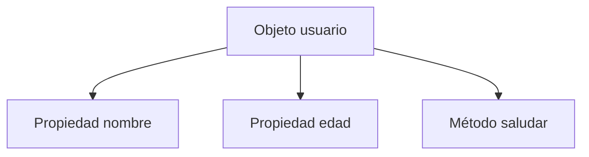
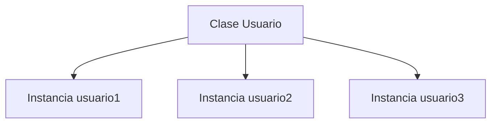
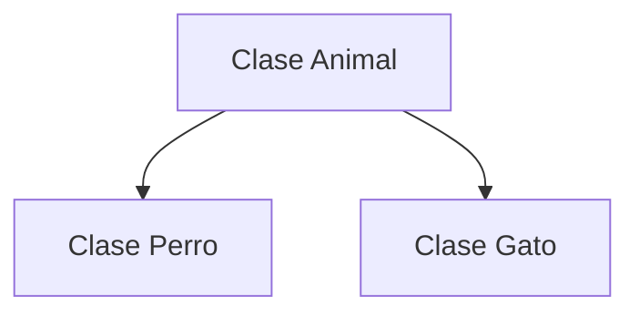

# 06. ¿Qué es la programación orientada a objetos?

## Introducción
A medida que las aplicaciones comenzaron a crecer en tamaño y complejidad, los desarrolladores se enfrentaron a un problema muy importante: **organizar correctamente el código.**

En programas pequeños, escribir funciones sueltas y variables independientes podía resultar suficiente. Sin embargo, en aplicaciones grandes, este enfoque terminaba generando código difícil de mantener, estructuras desorganizadas, duplicación de lógica y enormes dificultades para reutilizar componentes.

Para resolver este problema surgió un paradigma de programación conocido como: **Programación Orientada a Objetos (POO)**

La Programación Orientada a Objetos propone una **forma distinta de estructurar el software**, organizando la información y el comportamiento en entidades llamadas: **objetos.**

Estos objetos permiten **representar elementos** del mundo real dentro del programa, agrupando **datos, propiedades, estados y comportamientos relacionados.** Gracias a este enfoque, los desarrolladores pueden construir aplicaciones **más organizadas, más escalables, más reutilizables y mucho más fáciles de mantener.**

Actualmente, la programación orientada a objetos es uno de los paradigmas más utilizados en el desarrollo moderno y aparece constantemente en **JavaScript, Java, Python, C#, frameworks, videojuegos, APIs y aplicaciones empresariales.**

Comprender correctamente cómo funciona la **POO** es fundamental para desarrollar software profesional y entender la arquitectura de aplicaciones modernas.

## ¿Qué es la Programación Orientada a Objetos?
La Programación Orientada a Objetos, también conocida como: **POO** (*Object Oriented Programming*), es un paradigma de programación basado en la **creación y utilización de objetos.**

Su principal objetivo consiste en **organizar** el código de una forma mucho **más estructurada**, agrupando dentro de una misma entidad tanto la **información como las acciones relacionadas con ella**. En lugar de trabajar con datos y funciones completamente separados, la **POO** propone representar elementos reales mediante objetos capaces de almacenar propiedades, estados y comportamientos asociados.

Por ejemplo, dentro de una aplicación puede existir un objeto que represente un usuario. Ese objeto podría contener información como su **nombre, edad o correo electrónico**, pero también acciones relacionadas con él, como **iniciar sesión, actualizar datos o cerrar sesión**.

Gracias a este enfoque, el código puede organizarse de una manera mucho más lógica y modular. Esto facilita enormemente el mantenimiento de aplicaciones grandes y permite reutilizar estructuras sin necesidad de duplicar constantemente la lógica del programa.

Actualmente, la Programación Orientada a Objetos es uno de los paradigmas más utilizados del desarrollo moderno y aparece constantemente en aplicaciones web, videojuegos, APIs, frameworks y sistemas empresariales.

## ¿Por qué surgió la Programación Orientada a Objetos?
Antes de la popularización de la **POO**, muchas aplicaciones se desarrollaban utilizando programación procedural, donde el código se organizaba principalmente mediante funciones y secuencias de instrucciones.

Aunque este enfoque funcionaba correctamente en programas pequeños, a medida que las aplicaciones crecían comenzaban a aparecer **numerosos problemas** relacionados con la organización del código. Muchas veces la lógica terminaba dispersa en diferentes partes del programa, resultaba difícil reutilizar componentes y mantener proyectos grandes se volvía cada vez más complejo.

**La Programación Orientada a Objetos** surgió precisamente para **resolver** este problema. Su objetivo era permitir una estructura más **organizada y modular** capaz de representar **entidades reales dentro del software**.

Gracias a este paradigma, los desarrolladores comenzaron a **dividir aplicaciones complejas** en **componentes independientes** mucho más fáciles de comprender, reutilizar y mantener con el paso del tiempo.

## ¿Qué es un objeto?

Un objeto es una estructura que representa una **entidad** dentro del programa.

Los objetos permiten **almacenar información y comportamiento relacionados** dentro de una misma unidad lógica. Esto significa que un objeto puede contener tanto **propiedades** como **métodos** asociados a esa entidad concreta. Por ejemplo, un usuario podría representarse mediante un objeto que almacene datos como el nombre y la edad, pero también acciones como iniciar sesión o mostrar información en pantalla.

En JavaScript, los objetos son uno de los elementos **más importantes** del lenguaje y forman parte fundamental de prácticamente cualquier aplicación moderna.

## Ejemplo básico de objeto
```js
const usuario = {
    nombre: "Luccia",
    edad: 23,

    saludar() {
        console.log("Hola");
    }
};
```
En este ejemplo, el objeto **usuario** agrupa toda la información relacionada con una misma entidad.

Las propiedades:
```js
nombre
```
y

```js
edad
```
almacenan **datos** asociados al usuario.

Mientras tanto, el **método**:
```js
saludar()
```
representa una **acción** que el objeto puede ejecutar.

Gracias a esta estructura, JavaScript permite mantener relacionados tanto los **datos** como los **comportamientos** dentro de una misma entidad organizada.



## Propiedades y métodos
Dentro de la **Programación Orientada a Objetos**, los objetos suelen estar compuestos por **propiedades y métodos**.

Las propiedades representan **información asociada al objeto**, mientras que los métodos representan **acciones o comportamientos** que ese objeto puede ejecutar.

Por ejemplo, en un **objeto** que represente un **coche**, las **propiedades** podrían almacenar **información** como el **color** o la **velocidad**, mientras que los **métodos** podrían encargarse de **acelerar**, **frenar** o **encender el motor**.

Esta combinación entre datos y comportamiento es una de las características más importantes de la Programación Orientada a Objetos, ya que permite modelar entidades reales de una forma mucho más natural y organizada.

## ¿Qué es una clase?
Una clase es una **plantilla** utilizada para **crear objetos**.

Las clases permiten **definir** cómo serán los objetos creados a partir de ellas, especificando qué propiedades tendrán y qué métodos podrán utilizar.

Podría decirse que una clase funciona como un **molde**. A partir de ese molde, JavaScript puede generar **múltiples objetos similares** que compartan la **misma estructura y comportamiento**, pero **almacenando información diferente**.

Por ejemplo, una clase llamada:
```js
Usuario
```
podría utilizarse para crear muchos usuarios distintos dentro de una aplicación.

Cada objeto creado a partir de una clase recibe el nombre de: **instancia**.

## Sintaxis básica de una clase
```js
class Usuario {

    constructor(nombre, edad) {
        this.nombre = nombre;
        this.edad = edad;
    }

    saludar() {
        console.log("Hola");
    }
}
```
En este ejemplo, la palabra clave:
```js
class
```
define una nueva clase llamada **Usuario**.

Dentro de ella aparece el método:
```js
constructor()
```
que se encarga de **inicializar** las propiedades de cada objeto creado.

Además, el método:
```js
saludar()
```
define un **comportamiento** disponible para todas las instancias generadas a partir de esta clase.

## Crear objetos a partir de una clase
```js
const usuario1 = new Usuario("Luccia", 23);
```
Cuando JavaScript encuentra la palabra clave:
```js
new
```
crea **automáticamente** una nueva **instancia** basada en la clase indicada.

Durante este proceso:
- se reserva memoria,
- se genera un nuevo objeto,
- y el constructor inicializa automáticamente las propiedades correspondientes utilizando los valores proporcionados.
Gracias a esto, múltiples objetos pueden compartir la misma estructura sin necesidad de repetir constantemente el mismo código.



## ¿Qué es el constructor?
El constructor es un **método especial** utilizado para **inicializar** objetos creados a partir de una clase. Su función principal consiste en **asignar valores iniciales** a las propiedades de cada instancia.

Cada vez que JavaScript crea un nuevo objeto utilizando la palabra:
```js
new
```
el constructor se ejecuta **automáticamente**. Gracias a este sistema,** diferentes objetos** pueden almacenar información distinta aunque todos pertenezcan a la misma clase.

## ¿Qué representa this?
Dentro de la Programación Orientada a Objetos, la palabra clave:
```js
this
```
representa el **objeto actual sobre el que se está trabajando**.

Gracias a **this**, las clases pueden **acceder** a las propiedades y métodos pertenecientes a cada instancia concreta.
Por ejemplo:
```js
this.nombre
```
permite acceder a la propiedad **nombre** del objeto actual.

El uso de **this** es fundamental dentro de la **POO** porque permite que **cada objeto gestione su propia información internamente** sin interferir con otros objetos.

## Los 4 pilares de la Programación Orientada a Objetos
La Programación Orientada a Objetos se construye sobre cuatro principios fundamentales conocidos como: **pilares de la POO**.

Estos pilares son:
- encapsulamiento,
- abstracción,
- herencia,
- y polimorfismo.

Cada uno de estos conceptos cumple una **función específica** y **juntos** permiten desarrollar **aplicaciones mucho más organizadas, reutilizables y fáciles de mantener.**

## Encapsulamiento
El encapsulamiento consiste en proteger la **información interna de un objeto** y **controlar** cómo puede **accederse o modificarse** desde el **exterior**.

Gracias a este principio, los objetos pueden mantener ciertos datos **privados** y **evitar modificaciones incorrectas** que puedan afectar negativamente al funcionamiento del programa.

El encapsulamiento ayuda a mejorar enormemente la seguridad, organización y estabilidad del código.
## Ejemplo basico de encapsulamiento
```js
class Usuario {

    #password;

    constructor(nombre, password) {
        this.nombre = nombre;
        this.#password = password;
    }

    mostrarPassword() {
        return this.#password;
    }

}

const usuario1 = new Usuario("Luccia", "1234");

console.log(usuario1.mostrarPassword());
```
En este ejemplo, la propiedad **#password** es **privada** gracias al símbolo **#**.

Esto significa que no puede accederse directamente desde fuera de la clase, lo que ayuda a proteger la información interna del objeto.

## Abstracción
La abstracción consiste en **ocultar la complejidad interna de un sistema** y mostrar únicamente la **información necesaria** para utilizarlo.

Por ejemplo, cuando una persona conduce un coche no necesita comprender todos los detalles internos del motor para poder utilizarlo correctamente.

En programación ocurre exactamente lo mismo.

La abstracción permite trabajar con **objetos** y **funcionalidades** sin necesidad de conocer toda su implementación interna, **simplificando** enormemente el **desarrollo de aplicaciones complejas**.

## Ejemplo basico de abstracción
```js
class Coche {

    encender() {
        console.log("El coche está encendido");
    }

}

const miCoche = new Coche();

miCoche.encender();
```
En este ejemplo, el usuario únicamente utiliza el método **encender()** sin necesidad de conocer todo el funcionamiento interno del coche.

Esto representa la abstracción, ya que la complejidad interna queda oculta y solo se muestra la funcionalidad necesaria.

## Herencia
La herencia permite que una clase pueda **reutilizar propiedades y métodos pertenecientes a otra clase**. Gracias a este mecanismo, JavaScript puede crear relaciones entre clases **evitando duplicar** constantemente el mismo código.

Por ejemplo, una clase:
```js
Animal
```
podría compartir características comunes con otras clases como:
```js
Perro
```
o
```js
Gato
```
Esto facilita enormemente la reutilización y ampliación de funcionalidades dentro de una aplicación.


## Ejemplo basico de herencia
```js
class Vehiculo {
    arrancar() {
        console.log("El vehículo arrancó");
    }
}

class Moto extends Vehiculo {}

const miMoto = new Moto();

miMoto.arrancar();
```
La clase **Moto** hereda el método **arrancar()** de la clase **Vehiculo**.

Gracias a la herencia, una clase puede utilizar funcionalidades de otra sin duplicar código.

## Polimorfismo
El polimorfismo permite que **distintos objetos** puedan **responder** de maneras **diferentes** utilizando un **mismo método**.

Esto significa que **diferentes clases** pueden **compartir una misma acción**, pero **ejecutarla de forma distint**a según el contexto correspondiente.

Gracias al polimorfismo, el código se vuelve mucho más **flexible y reutilizable**, ya que una misma interfaz puede adaptarse automáticamente a diferentes comportamientos.

## Ejemplo basico de polimorfismo
```js
class Animal {
    sonido() {
        console.log("Sonido");
    }
}

class Perro extends Animal {
    sonido() {
        console.log("Guau");
    }
}

const perro = new Perro();

perro.sonido();
```
La clase **Perro** modifica el **comportamiento** del método **sonido()** heredado de **Animal**.

Esto es polimorfismo: un mismo método puede comportarse de forma diferente según la clase que lo utilice.

## Ventajas de la Programación Orientada a Objetos
La Programación Orientada a Objetos se ha convertido en uno de los paradigmas más utilizados del desarrollo moderno porque permite **construir aplicaciones mucho más organizadas y escalables.**

Gracias a este enfoque, el código puede reutilizarse fácilmente, los proyectos grandes resultan más sencillos de mantener y las aplicaciones pueden dividirse en componentes independientes mucho más manejables.

Además, facilita enormemente el **trabajo en equipo** y permite **ampliar funcionalidades** sin necesidad de reestructurar constantemente todo el sistema.

## Desventajas de la Programación Orientada a Objetos
Aunque la **POO** ofrece enormes ventajas, también presenta ciertas limitaciones.

En proyectos pequeños, utilizar estructuras orientadas a objetos puede resultar **innecesariamente complejo** y generar más dificultad de la necesaria.

Además, conceptos como herencia, encapsulamiento o polimorfismo pueden resultar **difíciles de comprender** para personas que están comenzando a programar.

Por este motivo, es importante **aprender gradualmente** cómo funciona este paradigma antes de utilizarlo en aplicaciones complejas.

## Conclusión
**La Programación Orientada a Objetos es uno de los paradigmas más importantes y utilizados del desarrollo moderno**.

Gracias a su capacidad para organizar el código mediante objetos, clases y estructuras reutilizables, permite construir aplicaciones mucho más limpias, escalables y fáciles de mantener.

Conceptos como clases, objetos, herencia, encapsulamiento, abstracción y polimorfismo forman parte fundamental del desarrollo profesional de software.

Comprender correctamente cómo funciona la **POO** es esencial para desarrollar aplicaciones modernas y trabajar con arquitecturas reales de software.

