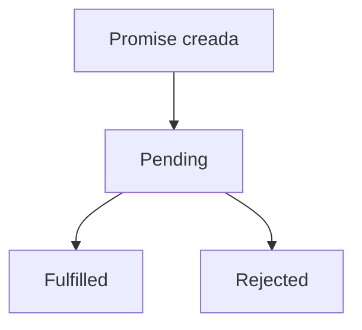

# 07. ¿Qué es una promesa en JS?

## Introducción
En programación, muchas tareas no se ejecutan de forma inmediata. Algunas operaciones pueden tardar cierto tiempo en completarse debido a que dependen de **procesos externos**, como **consultar una API, cargar archivos, acceder a una base de datos o esperar respuestas de un servidor.**

JavaScript es un lenguaje **síncrono** por naturaleza, lo que significa que normalmente **ejecuta el código línea por línea** siguiendo un orden **secuencial**.

Sin embargo, si JavaScript tuviera que detener completamente la ejecución mientras espera que una operación lenta termine, las aplicaciones se volverían extremadamente **poco eficientes** y la experiencia del usuario sería muy mala.

Para solucionar este problema, JavaScript incorpora mecanismos de programación **asíncrona** capaces de continuar ejecutando otras tareas mientras ciertas operaciones se completan en segundo plano.

Durante muchos años, este tipo de comportamiento se gestionaba principalmente mediante: *callbacks*.

Aunque los callbacks permitían manejar **operaciones asíncronas**, cuando las aplicaciones crecían comenzaban a generar estructuras **difíciles de leer y mantener**, produciendo lo que comúnmente se conoce como: *callback hell*.

Para resolver este problema, JavaScript introdujo las: **Promesas (Promises)**.

Las **promesas** permiten representar el **resultado futuro** de una operación **asíncrona**, proporcionando una forma mucho más **organizada, legible y controlada** de trabajar con **procesos** que **tardan tiempo** en completarse.

Actualmente, las **promesas** son una parte fundamental del JavaScript moderno y aparecen constantemente en **APIs, peticiones HTTP, bases de datos, frameworks y prácticamente cualquier aplicación moderna**.

Comprender correctamente cómo funcionan las **promesas** es **esencial** para trabajar profesionalmente con JavaScript y entender el funcionamiento de la **programación asíncrona**.

## ¿Qué es una promesa?
Una **promesa** es un **objeto especial** de JavaScript utilizado para representar el **resultado futuro de una operación asíncrona**.

Cuando una operación tarda cierto tiempo en completarse, JavaScript crea una **promesa** capaz de **“prometer”** que en algún momento esa operación **finalizará correctamente** o **producirá un error**.

Esto significa que una promesa actúa como una especie de **“contenedor temporal”** que almacenará el **resultado** cuando la operación termine.

Mientras la operación sigue ejecutándose, JavaScript puede continuar realizando otras tareas sin bloquear completamente la aplicación.

Gracias a este sistema, las promesas permiten trabajar con procesos **asíncronos** de una forma mucho más **organizada y legible** que utilizando múltiples callbacks anidados.

## ¿Por qué surgieron las promesas?
Antes de la aparición de las promesas, las operaciones asíncronas se manejaban principalmente mediante *callbacks*.

Un *callback* es una función que se **ejecuta** cuando otra operación **termina**.

Aunque este sistema funcionaba correctamente en tareas simples, en aplicaciones grandes comenzaban a aparecer problemas importantes relacionados con la legibilidad y el mantenimiento del código. Muchas veces los callbacks terminaban anidados unos dentro de otros, creando estructuras extremadamente difíciles de comprender.

Por ejemplo:
```js
obtenerUsuario(function(usuario) {

    obtenerPedidos(usuario, function(pedidos) {

        obtenerPago(pedidos, function(pago) {

            console.log(pago);

        });

    });

});
```

Este problema recibió el nombre de:
*callback hell*.

Las promesas fueron introducidas para resolver esta situación y permitir manejar operaciones asíncronas utilizando una estructura mucho más limpia, organizada y fácil de mantener.

## ¿Por qué las promesas son necesarias?
JavaScript es un lenguaje síncrono por naturaleza. Esto significa que normalmente ejecuta el código línea por línea, siguiendo un orden secuencial donde cada instrucción debe finalizar antes de que la siguiente pueda comenzar.

Este comportamiento funciona perfectamente en operaciones rápidas. Sin embargo, ciertos procesos pueden tardar bastante tiempo en completarse, especialmente cuando dependen de recursos externos.

Por ejemplo:
- consultar una API,
- descargar información de internet,
- acceder a una base de datos,
- o cargar archivos,
son operaciones que pueden requerir varios segundos.

Si JavaScript se detuviera completamente mientras espera estas tareas, la aplicación quedaría **bloqueada temporalmente** y dejaría de responder correctamente.

Imagina una página web donde el usuario **pulsa un botón** y toda la interfaz se **congela** hasta recibir una respuesta del servidor. **La experiencia sería extremadamente mala**.

Para evitar este problema, JavaScript utiliza programación asíncrona.

Gracias a este sistema, ciertas operaciones pueden ejecutarse en **segundo plano** mientras el resto del programa continúa funcionando normalmente.

Las promesas surgieron precisamente para gestionar este tipo de operaciones asíncronas de una forma mucho más organizada y legible.

En lugar de bloquear completamente la ejecución, las promesas permiten que JavaScript “prometa” que devolverá un resultado más adelante cuando la operación termine.

## Estados de una promesa
Una promesa puede encontrarse en tres estados diferentes durante su ciclo de vida.

### Pending
El estado:
```js
Pending 
```
significa que la operación **todavía sigue ejecutándose** y aún no se ha completado. Durante este estado, JavaScript permanece esperando el resultado final.

### Fulfilled
El estado:
```js
Fulfilled 
```
indica que la operación **terminó correctamente** y la promesa obtuvo un **resultado exitoso**.

En este momento, la promesa devuelve el valor generado.

### Rejected
El estado:
```js
Rejected 
```
significa que ocurrió un **error** durante la ejecución de la operación.

En este caso, la promesa **almacena información** relacionada con el **fallo producido**.

# Flujo interno de una promesa


## Crear una promesa
En JavaScript, las promesas se crean utilizando la palabra clave:
```js
Promise 
```
La estructura básica es la siguiente:
```js
const promesa = new Promise((resolve, reject) => {

});
```
Cuando JavaScript crea una promesa, recibe automáticamente dos funciones especiales:
- resolve
- y reject.

Estas funciones permiten controlar el resultado final de la operación.

## ¿Qué hace resolve?
La función:
```js
resolve() 
```
se utiliza cuando la operación **finaliza correctamente**.

Al ejecutarse, la promesa cambia automáticamente al estado:
```js
Fulfilled 
```
y devuelve el resultado correspondiente.

## ¿Qué hace reject?
La función:
```js
reject() 
```
se utiliza cuando ocurre un **error** durante la operación.

Cuando se ejecuta, la promesa cambia automáticamente al estado:
```js
Rejected 
```
y **almacena** la **información** relacionada con el **error**.

## ¿Qué ocurre internamente en una promesa?
Cuando JavaScript crea una promesa, la operación asociada comienza a ejecutarse automáticamente.

Mientras esa operación sigue procesándose, la promesa entra en estado:
```js
Pending 
```
Durante este tiempo, JavaScript **NO** se detiene.

El motor del lenguaje continúa ejecutando el resto del programa mientras la operación asíncrona sigue funcionando en **segundo plano.** Cuando finalmente la operación termina, la promesa cambia automáticamente de estado.

Si todo salió correctamente, la promesa pasa a:
```js
Fulfilled 
```
y devuelve un resultado.

Sin embargo, si ocurre algún problema durante la ejecución, la promesa cambia a:
```js
Rejected 
```
y genera un error.

Gracias a este comportamiento, JavaScript puede gestionar operaciones **lentas** sin **bloquear** completamente la aplicación.

## Ejemplo realista de una promesa
```js
const promesa = new Promise((resolve, reject) => {

    setTimeout(() => {

        resolve("Datos recibidos del servidor");

    }, 3000);

});
```
En este ejemplo, JavaScript crea una nueva promesa que **simula** una operación **lenta** utilizando:
```js
setTimeout() 
```
La función espera:
```js
3000 milisegundos 
```
antes de ejecutar:
```js
resolve() 
```
Durante esos 3 segundos, la promesa permanece en estado:
```js
Pending 
```
Sin embargo, JavaScript no se bloquea ni se detiene completamente.

Mientras la promesa espera, el resto del programa puede seguir ejecutándose normalmente.

Cuando el temporizador finaliza, la promesa cambia automáticamente al estado:
```js
Fulfilled 
```
y devuelve el mensaje:
```plain text
"Datos recibidos del servidor" 
```
Este comportamiento es precisamente lo que hace **tan importante** la programación **asíncrona** en **JavaScript moderno**.

## Consumir promesas con .then()
Cuando una promesa finaliza correctamente, JavaScript permite acceder automáticamente al resultado utilizando el método:
```js
.then() 
```
```js
promesa.then((resultado) => {

    console.log(resultado);

});
```
El método **.then()** permanece esperando hasta que la promesa cambia al estado:
```js
Fulfilled 
```
Cuando esto ocurre, JavaScript ejecuta automáticamente la **función interna** y **recibe el valor enviado** mediante:
```js
resolve() 
```
En este caso, el parámetro:
```js
resultado 
```
contendrá el valor:
```plain text
"Datos recibidos del servidor" 
```
Gracias a **.then()**, las promesas permiten **manejar resultados futuros** sin necesidad de detener completamente la ejecución del programa.

## ¿Qué ocurre internamente con .then()?
Uno de los aspectos más importantes de las promesas es comprender que **.then() NO ejecuta inmediatamente su función interna**.

Cuando JavaScript encuentra:
```js
.then() 
```
simplemente **registra una función** que deberá ejecutarse más adelante cuando la promesa termine correctamente.

Mientras la promesa siga en estado:
```js
Pending 
```
la función permanece “en espera”.

Cuando finalmente la promesa se **resuelve**, JavaScript **detecta** que el resultado ya está **disponible** y ejecuta automáticamente el **código contenido dentro de .then()**.

Gracias a este mecanismo, las aplicaciones pueden continuar funcionando mientras esperan operaciones lentas en segundo plano.

## Manejar errores con .catch()
Las promesas también permiten manejar **errores** de una forma mucho **más organizada** utilizando:
```js
.catch() 
```
```js
promesa.catch((error) => {

    console.log(error);

});
```
Cuando una promesa ejecuta:
```js
reject() 
```
JavaScript cambia automáticamente la promesa al estado:
```js
Rejected 
```
y envía el error hacia .catch().

Esto permite **centralizar** el **manejo de errores** y **evitar** enormes cantidades de **validaciones manuales** repartidas por todo el código.

Gracias a este sistema, las promesas resultan muchísimo más limpias y fáciles de mantener que los callbacks tradicionales.

## Encadenamiento de promesas
Una de las características más potentes de las promesas es la posibilidad de **encadenar múltiples operaciones asíncronas**.
```js
obtenerUsuario()

    .then((usuario) => {

        return obtenerPedidos(usuario);

    })

    .then((pedidos) => {

        return obtenerPago(pedidos);

    })

    .then((pago) => {

        console.log(pago);

    })

    .catch((error) => {

        console.log(error);

    });
```
En este ejemplo, cada **.then()** espera automáticamente el **resultado del anterior antes de continuar.**

Esto permite ejecutar múltiples operaciones asíncronas manteniendo una estructura mucho más organizada y legible.

A diferencia del antiguo: *callback hell*, las promesas permiten construir flujos asíncronos mucho más fáciles de comprender y mantener.


## Relación entre promesas y Event Loop
JavaScript utiliza internamente un sistema conocido como: **Event Loop**.

El **Event Loop** es el mecanismo encargado de **gestionar tareas asíncronas dentro del lenguaje.**

Cuando una promesa permanece **pendiente**, JavaScript no detiene completamente la ejecución del programa. En lugar de eso, **continúa ejecutando** otras instrucciones mientras la operación sigue procesándose en segundo plano.

Cuando la promesa finalmente cambia de estado y el resultado está disponible, el Event Loop detecta que la operación terminó y ejecuta automáticamente los métodos:
- .then()
- o .catch().

Gracias a este sistema, JavaScript puede manejar miles de operaciones asíncronas sin bloquear completamente la aplicación.

## Relación entre promesas y async/await
Con el tiempo, JavaScript introdujo: **async/await**, como una forma todavía más sencilla de trabajar con promesas.

Aunque visualmente parezca una característica diferente, internamente: **async/await sigue utilizando promesas**.

La principal diferencia es que permite **escribir código asíncrono** utilizando una **sintaxis** mucho más parecida al **código síncrono tradicional**.

Esto hace que muchas operaciones asíncronas resulten todavía más fáciles de leer y mantener.

## Ventajas de las promesas
Las promesas se convirtieron rápidamente en una de las herramientas más importantes del JavaScript moderno porque permiten organizar muchísimo mejor el código asíncrono.

Gracias a ellas, el flujo de ejecución resulta mucho **más claro** y **el manejo de errores** puede centralizarse de forma mucho **más limpia.**

Además, facilitan enormemente el **encadenamiento de operaciones asíncronas** y evitan gran parte de los problemas generados por los callbacks anidados.

Precisamente por esta combinación entre organización, legibilidad y control, las promesas forman parte fundamental del desarrollo moderno en JavaScript.

## Desventajas de las promesas
Aunque las promesas representan una enorme mejora respecto a los callbacks tradicionales, también presentan ciertas limitaciones.

Cuando las cadenas de .then() comienzan a crecer demasiado, el flujo puede volverse **complejo y difícil de seguir**.

Además, comprender correctamente el funcionamiento interno de la asincronía, el Event Loop y las promesas puede resultar **complicado** para personas que están comenzando a programar.

Por este motivo, es importante practicar bastante este tipo de estructuras para comprender realmente cómo funciona JavaScript internamente.

## Conclusión
Las promesas son uno de los elementos más importantes del JavaScript moderno y forman parte fundamental de la programación asíncrona.

Gracias a su capacidad para representar operaciones futuras, permiten trabajar con procesos asíncronos de una forma mucho más organizada, legible y mantenible.

Conceptos como:
- resolve,
- reject,
- .then(),
- .catch(),
- y el encadenamiento de promesas,

forman parte esencial del desarrollo moderno en JavaScript.

Comprender correctamente cómo funcionan las promesas es fundamental para trabajar con APIs, servidores, bases de datos y aplicaciones profesionales modernas.
